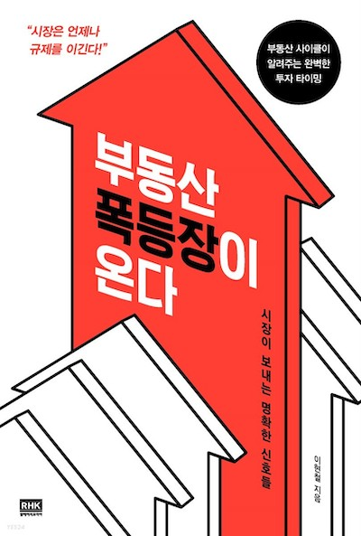
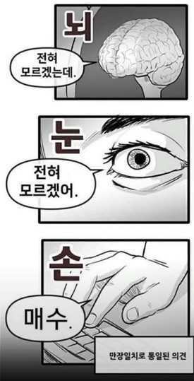
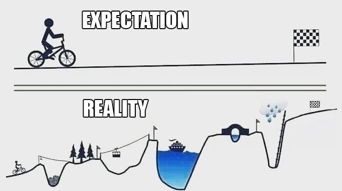

> 나는 천체의 움직임까지 계산할 수 있지만, 인간의 광기는 도저히 계산할 수가 없다. - 뉴턴

부동산 가격은 항상 오르기만 한다고 생각해왔었지만 최근 부동산 가격이 하락하기 시작했습니다. 쥐꼬리만한 월급을 받고 있는 내게 향후 내집 마련의 꿈은 어림도 없겠구나 싶었지만 왠지 가능성이 생길 것만 같습니다. 그렇게 점점 부동산에 관심을 갖게 되었고, 이현철 소장의 책 《부동산 폭등장이 온다》라는 책을 추천받아 입문서로 읽어보았습니다. 

이 책은 우리나라의 부동산이 하락기, 하락 안정기, 상승기, 상승 조정기 및 폭등기의 사이클을 반복하고 있음을 설명합니다. 부동산 사이클과 더불어 우리나라에만 있는 전세제도가 부동산 시장에 어떤 영향을 끼치는지 꽤나 이해하게 된 것 같습니다.

## 투기의 역사

어떤 상품이든 가격이 오르는 상황이 지속되면 사람들은 그것에 관심을 가지기 시작합니다. 또한 여기저기서 돈을 벌었다는 사람들이 등장합니다. 이런 상황이 확대 및 재생산되면서 가치와 상관 없이 투기에 동참한 사람들에 의해 광풍이 불어닥칩니다. 하지만 산이 높아야 골이 깊다는 속담이 있듯 상승폭이 컸던 만큼 큰 하락폭으로 거품이 꺼집니다. **이러한 상황과 비합리적인 행동이 반복적으로 일어난 것이 바로 우리나라 부동산의 역사입니다.**

부동산 가격에 영향을 미치는 요인엔 금리, 인구수, 경기상황 및 공급수요 등이 있습니다. 이런 요인들이 부동산 가격에 잘 적용되기 위해서는 인간은 이성적이고 합리적이라는 전제조건이 필요합니다. 하지만 인간은 위기 상황이 오면 대응 지침을 잊어버립니다. 그저 분위기에 휩쓸릴 뿐이지요. 상품의 가치가 폭등하거나 폭락하는 상황에서 **인간은 이성이 아닌 본성에 따르기 쉬우므로 이런 요인들만 가지고 부동산을 분석하기에는 한계가 따릅니다.**

**따라서 우리나라 부동산 시장을 예측하기 위해서는 전세제도, 선분양제도, 부동산 정책 및 대중심리를 잘 이해해야 합니다.**

## 부동산 사이클을 결정짓는 힘

### 전세제도

우리나라에만 있는 **전세제도는 매매가격의 하락을 지지해주는 역할을 합니다.** 부동산 하락기에 매매가격과 전세가격이 지속적으로 하락하면 전세가격이 안정을 찾아가면서 상승 전환이 일어납니다. 매매가격이 계속 떨어지면 부동산 보유자가 전세로 갈아타기를 시도하면서 전세 수요가 늘고 공급은 줄어들기 때문입니다.

이후 인기 아파트의 전세가격이 상승해서 매매가격에 근접하여 인기 없는 아파트도 감지덕지해야 하는 상황이 됩니다. 이로 인해 매매가격이 오르지 않던 인기 없는 아파트도 **전세가격이 상승하여 매매가격에 근접하는 일이 발생합니다.**

전세 수요자가 늘면서 상승한 **전세가격이 매매호가를 밀어올립니다.** 매매 물건이 하나 정도 오른 가격에 거래되면, 이것을 기준으로 해당 아파트의 매매가격이 정해지고 호가가 더 올라가게 됩니다.

### 선분양제도

**선분양제도는 시행사가 토지를 확보한 뒤 아파트 착공 전후에 입주자를 모집하는 제도입니다.** 이 제도로 인해 부동산 상승기엔 분양 물량이 증가하고 하락기엔 초과 공급이 되는 일이 반복됩니다.

부동산 상승기엔 아파트 청약 경쟁률이 높아집니다. 집값이 오르리라는 심리가 깔려있기 때문에 청약에 떨어진 사람들이 프리미엄을 주고서라도 분양권을 사려고 합니다. 이렇게 시장이 점점 투기화됩니다. 입주물량이 대규모로 늘어나면 일시적으로 전세가격은 하락합니다. 이로인해 역전세난이 발생할 수 있지만 프리미엄이 높다면 전세가격도 그만큼 높게 형성됩니다.

### 부동산 정책

우리나라 역대 정권들은 부동산 시장이 침체되어 있을 때엔 규제 완화 정책을, 과열되어 있을 때엔 규제 강화 정책을 시행했습니다. 아주 단순하고 당연해 보이지만 이러한 **정책의 부작용으로 규제 완화 뒤 시장 과열이, 규제 강화 뒤 시장 침체가 이어진 것도 반복적으로 일어났습니다.**

부동산 상승을 완벽하게 막으려면 부동산 보유세를 한 30% 이상으로 지정하면 되지 않을까 싶습니다. 하지만 정부는 이런 정책을 시행할 수 없습니다. 비이성적으로 변하기도 하는 시장과 달리 정부는 이성적이고 합리적인 정책을 시행할 수 밖에 없고, 정부의 임기는 부동산 사이클 대비 비교적 짧은 5년이기 때문에 정권을 빼앗길 각오를 해야 하기 때문입니다.

## 부동산 사이클

### 하락기

하락기로 전환되기 전 발생하는 여건은 크게 네 가지가 있습니다. 

1. 초과 공급: 대형 아파트가 인기일 때는 대형 아파트를, 소형 아파트가 인기일 때는 소형 아파트를 많이 짓다 보니 어느 순간 초과 공급되어 당시 인기있는 면적이 미분양으로 남게됩니다.
2. 부담스러운 가격: 매수자들이 접근하기 어려운 가격까지 상승하면 매도-매수 간 힘겨루기 양상을 보이면서 지루한 정체 구간이 이어진 다음 하락 전환 여건이 마련됩니다.
3. 무분별한 투자자: 어떤 분야에서든 투기장이 끝나갈 무렵엔 무분별한 투자자들이 진입합니다. 이런 투자자들은 어려운 상황에 처했을 때의 대응책을 세워놓지 않았고 부동산 가격이 계속 오르리라는 확신이 없기 때문에 하락 전환 시 급매물을 내놓게 됩니다.
4. 낮은 전세가율: 부동산 상승 및 폭등기엔 매매가격의 상승폭이 크지만 전세가격은 완만하게 상승하므로 전세가율은 떨어집니다. 전세가율이 낮으면 아파트 매매가격이 떨어질 수 있는 폭이 매우 큽니다.

**하락장을 탄생시키는 뇌관은 바로 입주 미분양입니다.** 입주 미분양이 발생하면 잔금을 감당하지 못할 보유자들이 급매물을 내놓습니다. 이로 인해 매도물량이 쏟아집니다. 이런 입주 미분양은 다른 지역으로 확산되며 적체되기 시작합니다. 여기저기 미분양이 넘쳐나는 상황에서 신축 아파트의 입주가 시작되면 구축 아파트까지 매매가격과 전세가격이 떨어지기 시작합니다. 더불어 아파트 가격은 호가보다 저렴한 가격에 팔리고, 다시 그보다 저렴한 매물이 나와 팔리는 일이 반복됩니다.

이 시기에 계약을 연장하지 않으려는 임차인과 전세 보증금을 돌려줄 수 없는 임대인 사이의 분쟁이 발생하기 쉽습니다. 매수자를 찾는 것 자체가 어렵다보니 부동산 중개인은 매수자의 편을 들게 됩니다. 매도자가 매수자의 편의를 들어줘야 계약이 성사될 가능성이 커지기 때문입니다. 따라서 **매수자 우위의 시장으로 변하게 됩니다.**

**건설사들은 신규 공급을 축소합니다.** 건설사들은 아파트를 높은 가격에 팔 수 있느냐에 관심이 있습니다. 아파트를 높은 가격에 팔 수 없는 시기는 피하고자 하므로 기존에 짓기 시작했던 아파트 건설을 중단할 수 없는 경우를 제외하곤 아파트 공급 물량을 줄이게 됩니다.

따라서 하락장에 부동산을 보유하고 있다면 웬만한면 매도해야 합니다. 매도해서 얻은 현금으로 서울 시장과 반대 사이클을 그리고 있는 지방에 투자하는 것이 현명하다고 하지만... 2023년을 기준으로 서울과 지방 모두 같은 사이클을 타고있는 것 같습니다.

### 하락 안정기

**하락장에서 매매가격과 전세가격이 동반 하락하다가 어느 시점이 되면 전세가격이 상승 전환하기 시작합니다.** 이 때 하락하던 매매가격이 상승하는 전세가격과 만나게 됩니다. 이로 인해 전세가격이 상승하기 시작합니다.

**줄어들었던 입주물량 때문에 전세 물량도 줄어들게 됩니다.** 집값이 오를 거라는 기대가 사라져서 집을 사기보다는 빌리는 쪽을 택하는 사람들이 많아지므로 전세 수요가 늘어나게 됩니다. 이로 인해 전세가율이 점점 상승합니다. 인기 좋은 아파트는 전세가율이 60 ~ 70%에 이르면 매수자들이 서서히 거래를 시작하므로 이 시점에서 매매가격 하락이 멈춥니다. 인기 없는 아파트는 전세가율이 80%에 육박하거나 넘을 때까지 계속 하락할 수 있습니다.

여기저기 미분양된 아파트가 널려있는 상황에 **매수자를 유혹하는 특별 혜택으로 인해 새 아파트 미분양 물건에 계약이 집중됩니다.** 이 때 거래량은 최근 몇 년 사이 최대치를 기록하지만 대부분 미분양 물건의 거래량이므로 가격 변화는 거의 없습니다. 어찌됐든 미분양 물건이 시장에서 점점 사라지게 됩니다.

### 상승기

**상승기엔 전세가격이 매매가격을 지지하여 전세가격이 점차 상승합니다.** 또한 실수요에 가수요(만기 6개월 전부터 전셋집을 미리 구하려는 수요)까지 붙게 되어 **전세난이 시작됩니다.** 전세난이 시작되면 전세가율이 최고치(인기 아파트는 70%, 선호도가 떨어지는 아파트는 80~90%)에 이르므로 **갭 투자가 성행하게 됩니다.**

**신규 아파트 분양 가격이 과거 상승장에 책정됐던 가격에 비해 낮게 책정**되며, 낮은 가격으로 인해 자연스레 프리미엄이 형성되며 완판됩니다.

**상승장 후반부에 분양권 및 갭 투자가 과열되면 정부의 규제가 시작됩니다.** 과열된 갭 투자로 인해 전세매물이 시장에 많이 나오면 전세 시장이 점차 안정화됩니다. 이 시기에 갭 투자자는 전세매물의 공급책이 되는 셈입니다.

### 상승 조정기

상승 조정기엔 정부의 역대급(?) 규제정책이 시행됩니다. 이로 인해 시장이 빠르게 얼어붙지만 그것도 잠시였을 뿐 다시 상승합니다. 그 이유는 하락장으로 돌아설 만큼의 여건이 완성되지 않았기 때문입니다. 올라가려는 힘을 정부가 잠시 인위적으로 억눌렀을 뿐, 웅크렸던 에너지(대중심리)가 응축되어 폭발하게 되는 것입니다. 하지만 **정부 입장에선 가만히 있을 수 없으므로 규제정책을 시행할 수 밖에 없습니다.**

**강력한 규제 정책이 나오더라도 보유자들은 계속 보유하는 쪽으로 마음을 다잡을 가능성이 큽니다.** 잠시 손실을 보더라도 계속해서 가격이 오를 거라는 심리 때문에 매도물량은 쏟아지지 않게 됩니다.

이 시기에 부동산 보유자는 무조건 존버(?)해야 하며, 일시적인 가격 조정을 하락 전환으로 오해한 매도자가 던진 매물을 과감하게 잡아볼 법합니다. 단 폭등기는 짧게 이어지므로 주의해야 합니다.

### 폭등기

부동산 가격 폭등 직전에 나타나는 전조 현상은 매도물량이 줄어드는 것이며, **폭등의 근본적인 원인은 대중심리입니다.** 이런 상황으로 몰고가는 건 다름아닌 정부 정책의 부작용입니다. 정부가 추가 규제를 시행하면 시장이 일시적으로 반응하지만 이미 내성이 생긴 시장엔 큰 효과가 나타나지 않습니다.

**부동산 가격이 폭등한 지역은 매수-매도 세력이 팽팽하게 붙는 정체구간으로 이어집니다.** 이 시기에는 부동산을 팔려고 해도 잘 팔리지 않습니다. 왜냐하면 가격이 너무 비싸고 시장 분위기가 가라앉았기 때문입니다. 이렇게 정체 구간을 이어가던 부동산은 어느 순간 하락장으로 들어서며 사이클이 반복됩니다.

## 기타

어느 지역이든 사람들이 관심을 두고 선호하는 동네가 있습니다. 그런 동네가 서울에선 강남입니다. 이 동네는 시장이 변할 때 항상 먼저 움직입니다. 그렇게 되면 대중의 관심이 아직 움직이지 않은 인접 지역으로 퍼져 나가고, 그 다음 인접 지역이 반응하면서 연쇄 작용이 일어나게 됩니다.

가격이 폭등할 때 부동산을 팔면 반드시 그보다 가격이 더 오르게 되어 있습니다. 이 때 매도자는 발목 매도(?)를 했다며 마음이 편치 않겠지만 이 상황에 익숙해지지 않으면 향후 합리적인 대응이 어렵습니다. 좀 더 오를 것이라고 확신하며 존버(?)하다간 팔고 싶어도 팔지 못하는 상황이 올 수 있습니다.

정부가 내놓는 부동산 규제와 완화는 마땅한 해결책이 아닙니다. 그저 시장이 극단적인 방향으로 흘러가는 것을 막기 위한 최선일 뿐입니다. 정부는 이성적으로만 대응할 수 밖에 없는 반면 시장은 비이성적으로 변하기도 하기 때문에 시장은 늘 언제나 정부를 이길 수 밖에 없지 않나... 싶습니다.

## 결론은... 어쩔TV?

2023년 2월 기준 하락장이 시작 중인 것으로 판단됩니다. 2022년까지 아파트 가격이 너무 많이 올랐고, 무분별하게 들어온 갭 투자자와 임대인-임차인 간 갈등에 대한 뉴스들이 간간이 보이기도 할 뿐만 아니라 [호갱노노](https://hogangnono.com)에서 여러 아파트의 전세가율을 보면 최저치를 기록한 후 점점 높아지고 있기 때문입니다. [전국 미분양이 7만 호 가량 육박한다는 뉴스](https://www.yna.co.kr/view/AKR20230131066552003)를 봤지만 [입주 미분양 물량](https://data.kbland.kr/publicdata/unsold-apartments)은 과거 하락장 대비 적어서 본격적인 하락장은 아직 아니지 않나 싶습니다.

하락 안정기가 올 때까지 꾸준히 부동산 공부를 하며 기회를 기다려야겠습니다. 과거 아파트 사이클 사례를 보면 향후 5 ~ 10년 사이에 기회가 오지 않을까 싶기도 하다가도... 2022년에 급격하게 오른 금리 인상의 여파로 인한 것인지 폭등 후 정체구간 없이 빠르게 하락장으로 전환되기 시작한 걸 보면 기회가 앞당겨 올 수 있을지도 모르겠습니다.