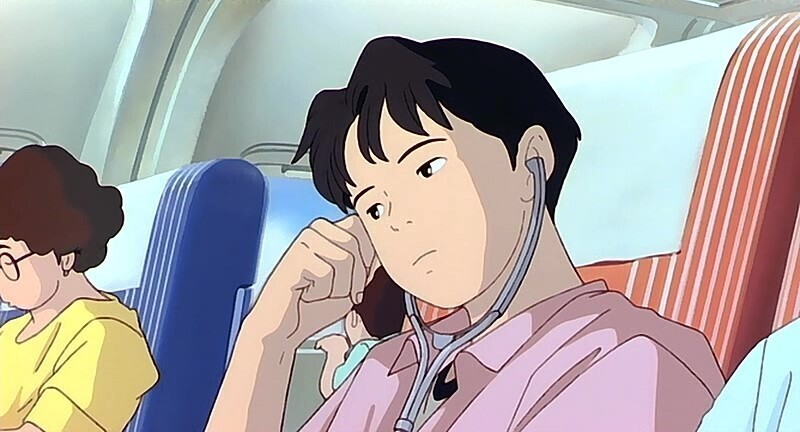
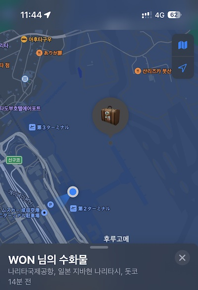
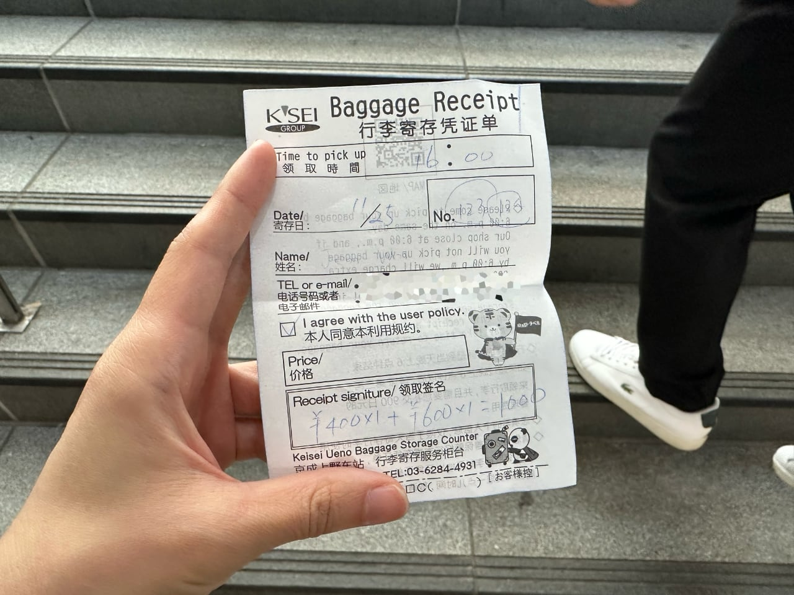

도쿄를 여러 번 여행하면서 정리해본 가이드...

## 🚄 아묻따 스카이 라이너 타세요

나리타 공항에서 도쿄 도심으로 이동하려면 케이세이 전철 또는 나리타 익스프레스 등을 타는 방법이 있지만 무조건 스카이라이너를 타고 갑니다. 비싸지만 가장 빠르기 때문.

## 💊 내가 캡슐호텔에 묵을 만한 상인가

캡슐호텔은 저렴하게 숙박할 수 있다는 장점이 있지만 그만큼 불편합니다. 아래 사항에 해당한다면 캡슐호텔에 묵는 걸 추천하지 않습니다.

1. **짐이 많거나 짐을 자주 풀어야 하는가?** 기내용 캐리어가 아니라면 캡슐호텔 짐 보관함에 캐리어가 들어가지 않는 경우가 있으며, 짐 보관함이 공용 공간에 있어서 짐을 풀고 정리할 때 사람들이 들락날락하면서 민망한 상황이 발생할 수 있습니다.
2. **소음에 민감한가?** 일본 법령상 잠을 자는 캡슐 입구에 잠금장치를 설치할 수 없으므로 방음이 되지 않습니다. 자는 와중에 히터 소리 등이 들려올 수 있어서 소음에 민감하면 잠을 제대로 잘 수 없습니다.

그럼에도 캡슐호텔에 묵기로 정했다면 아래 사항을 고려하는 게 좋습니다.

1. **연박 시 매일 체크아웃을 해야 하는가?** 대부분의 일본 캡슐호텔은 연박 시 매일 오전에 체크아웃을 해야 합니다. 그렇지 않은 캡슐호텔도 있으나 대부분 해야 한다고 보면 될 것 같습니다. 매일 체크아웃을 해야 하는 경우 짐을 원래 보관하던 장소에 계속 두게 해주긴 합니다.
2. **짐을 보관할 공간이 충분한가?** 기내용 캐리어도 안 들어가는 짐 보관함이 있거나, 보관함이 없어 카운터에 캐리어를 맡겨야 하는 곳도 있으니 꼭 알아보는 게 좋습니다.
3. **가능하면 2층보다는 1층 캡슐로** 가끔 재수없으면 2층 캡슐 입구 근처에 형광등이 있어 눈뽕(🤩)을 당할 수 있습니다.

지금까지 가본 일본 캡슐호텔 중에서 가장 괜찮았던 곳은 [마이큐브 바이 마이스테이 아사쿠사 쿠라마에](https://goo.gl/maps/JnVFp1NrsfTiwrVx7)입니다. 2층식이 아닌 1층식이라 침실이 아주 넓고 연박 시 매일 체크아웃을 하지 않아도 되며, 침실 밑에 엄청나게 넓은 짐 보관공간이 있기 때문입니다. 이 외에 [나인 아워스](https://maps.app.goo.gl/6mUr97ZuPHaNYpqz9)도 나쁘지 않았습니다.

## 🪀 에어태그는 있으면 굳굳

집에 하나 쯤 굴러 다니는(?) 국내한정 애물단지 에어태그를 캐리어에 넣고 비행기 위탁 수하물로 맡기면 해외 공항 도착 후 캐리어 위치를 확인할 수 있습니다. 캐리어가 가만히 있다가 어느 순간 움직이기 시작하면 짐 찾는 곳에서 곧 캐리어를 찾을 수 있음을 직감할 수 있습니다.

중요한 짐에 에어태그를 숨겨 놓았다면 분실 시 유용할 것 같습니다.

## 🧳 짐이 무거우면 케이세이우에노 역에 잠시 맡기기

여행 마지막 날 호텔 체크아웃 후 비행기 타러 갈 때까지 시간이 많이 남았지만 짐을 들고 여행하기 힘든 경우가 있습니다. 이 때 [케이세이우에노 역 내에 있는 짐 보관소](https://maps.app.goo.gl/1GxJGE3PK8pE7DtJ8)에 짐을 맡기면 편합니다. 작은 짐은 하루 400엔, 큰 짐은 하루 600엔에 맡길 수 있습니다.

기내용 캐리어 2개와 배낭 1개를 몇 시간 동안 맡겨봤더니 역무원이 기내용 캐리어 1개와 배낭 1개를 묶어서 600엔, 나머지 기내용 캐리어 1대는 400엔을 청구했습니다.

## 🚇 스이카랑 도쿄 서브웨이 티켓은 같이 사쓰세요... 제발

스이카는 일본에서 사용하는 선불 교통카드입니다. (파스모도 있지만 편의상 스이카라고만 하겠습니다.) 이 카드를 사용하면 일본 내 대부분의 전철, 버스, 택시, 심지어 자판기 등에서 사용할 수 있습니다. 스이카만 있으면 어디든 자유롭게 이동할 수 있지만 이것만 사용하면 돈이 엄청나게 깨집니다.

도쿄 서브웨이 티켓은 도쿄메트로 또는 도에이 전철 노선을 특정 기간 동안 무제한 사용할 수 있는 티켓입니다. 이 티켓만 사용하면 교통비를 많이 절약할 수 있지만 일부 전철을 탈 수 없습니다.

그래서 도쿄메트로 또는 도에이 노선을 타고 이동하는 경우 도쿄 서브웨이 티켓을 사용하고, 이 외의 노선을 탈 때는 스이카를 이용하는 게 가장 가성비가 좋습니다.

### 도쿄 서브웨이 티켓을 사용하는 경우

구글 지도 앱으로 목적지 경로를 검색한 후, 지하철 경로를 조회하면 탑승해야 하는 지하철 노선이 나타납니다. 이 중 **단색 동그라미 안에 알파벳이 하나 들어가 있는 노선에서 도쿄 서브웨이 티켓을 사용할 수 있습니다.**

아래 예를 들어 설명해보면, 긴자선과 히비야선 그리고 지요다선은 알파벳 한 자리에 단색 동그라미로 되어 있으므로 이 노선에서 도쿄 서브웨이 티켓을 사용할 수 있습니다.

단, 위 예시에 있는 게이힌토호쿠선은 알파벳 한 자리에 단색 동그라미가 아니어서 도쿄 서브웨이 티켓을 사용할 수 없으므로 대신 스이카를 사용해야 하고, 지요다 선으로 환승하여 내릴 땐 도쿄 서브웨이 티켓을 사용하면 됩니다.

### 스이카를 사용하는 경우

구글 지도 앱으로 목적지 경로를 검색한 후, 알파벳 한 자리에 단색 동그라미로 되어있지 않은 전철 노선에서 스이카를 사용합니다.

스이카는 사용할 일이 없더라도 1~2천엔 정도는 예비용으로 충전해두는 게 좋습니다. 예전에 하코네로 여행을 갔다가 강풍 때문에 케이블 카를 못 타게 되어 버스를 타야 할 일이 있었는데, 주변에 스이카를 충전할 곳이 없어서 스이카에 남은 잔액이 없었으면 큰일 날 뻔했습니다. 물론 현금을 내고 버스를 타고 되긴 하지만 버스요금을 내거나 거스름돈을 받을 때 시간을 꽤나 잡아먹을 수 있습니다.

### 도쿄 서브웨이 티켓과 스이카를 동시에 사용해야 하는 경우

**<U>탑승할 때 도쿄 서브웨이 티켓을, 하차할 때 스이카를 사용해야 하는 경우</U>**
1. 도쿄 서브웨이 티켓을 사용하여 전철에 탑승합니다.
2. 환승 역에서 도쿄 서브웨이 티켓을 사용하여 내린 후, 스이카로 다시 탑승합니다.
3. 하차할 역에서 스이카를 사용하여 하차합니다.

**<U>탑승할 때 스이카를, 내릴 때 도쿄 서브웨이 티켓을 사용해야 하는 경우</U>**
1. 스이카를 사용하여 전철에 탑승합니다.
2. 환승 역에서 스이카를 사용하여 내린 후, 도쿄 서브웨이 티켓으로 다시 탑승합니다.
3. 하차할 역에서 도쿄 서브웨이 티켓을 사용하여 하차합니다.

환승 역에서 내렸다가 다시 탑승하는 게 귀찮을 수 있지만 이렇게 하지 않으면 하차할 역에서 내릴 때 오류가 발생합니다. 이게 귀찮으면 환승 역에서 내렸다가 다시 타지 말고 하차할 역에서 역무원에게 정산해달라고 하면 됩니다.

### 스이카 잔액이 충분하지만 사용할 때 오류가 나는 경우

스이카는 6개월 이상 사용하지 않으면 잠기는 경우가 있습니다. 이 때 JR 지하철 역무원에게 락을 해제해달라고 하면 됩니다.

> スイカがロックされています。 ロックを解除してください。 
> 스이카가 롯쿠사레테이마스。 롯쿠오 카이조시테쿠다사이。
>
> 스이카에 락이 걸려있습니다. 락을 해제해주세요.