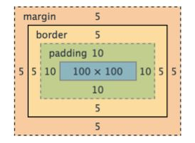
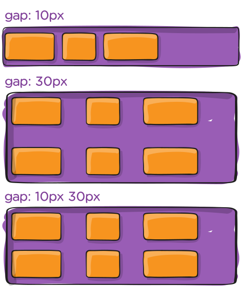
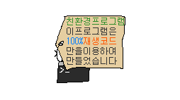

- [CSS 파일을 HTML 문서에 첨부하는 법](#css-파일을-html-문서에-첨부하는-법)
- [주요 스타일링](#주요-스타일링)
  - [글자 스타일](#글자-스타일)
  - [폰트](#폰트)
  - [Margin과 Padding](#margin과-padding)
  - [폭과 너비](#폭과-너비)
- [CSS 셀렉터](#css-셀렉터)
  - [기본적인 CSS 셀렉터](#기본적인-css-셀렉터)
  - [Pseudo-class](#pseudo-class)
  - [Pseudo-element](#pseudo-element)
  - [셀렉터의 우선 순위](#셀렉터의-우선-순위)
- [네모네모 div 박스 디자인](#네모네모-div-박스-디자인)
- [배경과 이미지 예쁘게 넣기](#배경과-이미지-예쁘게-넣기)
- [display 속성](#display-속성)
  - [display: block](#display-block)
  - [display: inline](#display-inline)
  - [display: inline-block](#display-inline-block)
  - [display: none](#display-none)
  - [display: flex](#display-flex)
  - [display: grid](#display-grid)
- [붕붕 띄우는 float 속성](#붕붕-띄우는-float-속성)
- [좌표 레이아웃 만들기](#좌표-레이아웃-만들기)
- [반응형 레이아웃 만들기](#반응형-레이아웃-만들기)
  - [미디어 쿼리(Media Query)](#미디어-쿼리media-query)
- [애니메이션](#애니메이션)
  - [Transition 속성](#transition-속성)
  - [Transform 속성](#transform-속성)
  - [키프레임 애니메이션](#키프레임-애니메이션)
  - [애니메이션 성능 개선](#애니메이션-성능-개선)
- [부트스트랩(Bootstrap)](#부트스트랩bootstrap)
  - [Utility Class](#utility-class)
  - [부트스트랩 Grid 레이아웃](#부트스트랩-grid-레이아웃)
  - [Order Class](#order-class)
- [Shadow DOM](#shadow-dom)
- [SCSS](#scss)
- [팁... 같은 것](#팁-같은-것)
  - [좋은 코드란?](#좋은-코드란)
  - [CSS 파일 작성 시 기본으로 쓰면 좋을 속성들](#css-파일-작성-시-기본으로-쓰면-좋을-속성들)
  - [CSS Normalize](#css-normalize)
  - [Class 작명법](#class-작명법)
  - [Emmet](#emmet)
  - [CSS 코드 덮어쓰기](#css-코드-덮어쓰기)


## CSS 파일을 HTML 문서에 첨부하는 법

head 태그 안에 link 태그를 넣고 CSS 파일 경로를 지정해주면 됨.

```html
<head>
  <link href="CSS_파일경로" rel="stylesheet">
</head>
```


## 주요 스타일링

거의 모든 태그는 style 속성을 사용할 수 있음. style 속성에 `스타일이름: 스타일값;` 형식으로 스타일을 명시해주면 됨.

```html
<div style="font-size: 16px;"></div>
```

### 글자 스타일

```css
font-size: 20px;
color: black;
letter-spacing: -1px;  /* 글자 간격 */
text-align: center;
font-weight: 600;      /* 굵기 */
```

### 폰트

HTML 요소에 폰트를 적용하려면 font-family 속성을 사용함.

* 폰트의 영문명을 사용해야 버그가 없음.
* 공백이 있는 폰트명이 있을 수 있으니 따옴표 안에 담는 게 좋음.
* 폰트를 여러 개 선언하면 제일 왼쪽에 있는 폰트부터 우선 적용됨.

```css
body { font-family : 'gulim', 'gothic', sans-serif; }
```

**설치되지 않은 폰트를 사용하려면...**

```css
@font-face {
  font-family: 'nanumsquare';
  src: url(FONT_PATH.woff);
}

body { font-family: 'nanumsquare', sans-serif; }
```

**웹폰트용 woff 파일**은 ttf 파일에 비해 용량이 3분의 1수준이므로 이걸 사용하는 게 웹 사이트 반응 속도에 유리함. 

[구글 폰트](https://fonts.google.com)를 사용하면 폰트파일을 구하지 않아도 됨.

**안티앨리어싱**은 픽셀의 각진 부분을 부드럽게 다듬어주는 것. 윈도우에서 특정 폰트를 매우 확대하거나 축소해서 보면 글자가 매우 각져보이는 경우가 있는데, 이 때 글자를 살짝 돌려주면 안티앨리어싱을 한 듯한 느낌을 줌.

```css
body { transform: rotate(0.04deg); /* 0.04도만큼 회전 */ }
```

### Margin과 Padding

margin은 바깥 여백, padding은 안쪽 여백임.



이 속성은 네 방향 값을 한 번에 줄 수 있음.

```css
.box { margin: 10px auto 10px auto; /* 시계방향(상우하좌) */ }
```

**body 태그엔 기본 margin이 있음.** 이 값을 0으로 설정하면 꽉 찬 페이지를 만들 수 있음.

**마진 상쇄(Margin Collapse) 현상**이란 게 있음. 이는 두 요소가 겹쳐지면 두 요소의 margin 값이 합쳐지는 현상인데, 서로 겹쳐진 두 요소 중 한 쪽의 margin 값만 변경했음에도 다른 한 쪽의 margin 값도 변경돼버림. 이 현상을 막으려면 두 요소의 테두리를 겹치지 않게 하면 됨. 예를 들어, 부모 박스에 padding 값을 1 픽셀이라도 주면 됨.

HTML 요소에 width, height 값을 주면 기본적으로 padding 안쪽 부분인 컨텐트 영역에만 width, height 값이 반영됨. 따라서 요소가 내가 설정한 값보다 크게 보일 수 있음. 이 현상이 발생하는 원인은 box-sizing 속성의 기본값이 content-box이기 때문.

**`box-sizing: border-box;` 속성을 추가하면 width, height 값에 padding, border 및 margin 값이 포함됨.** div 태그 속성에 추가해놓으면 편함.

### 폭과 너비

폭과 너비 속성 값에 쓰는 단위는...

* vw: 브라우저 폭 기준 몇 %?
* vh: 브라우저 높이 기준 몇 %?
* rem: 기본 폰트 사이즈(font-size 속성)의 몇 배 크기?
* em: 내 폰트 사이즈 기준 몇 배 크기?

rem은 폰트 사이즈를 키우더라도 레이아웃이 이에 맞게 비례하여 확장되므로 레이아웃이 깨지지 않도록 하기 위해 사용하나, 주로 타이포그래피(활판술) 디자인에서 폰트 사이즈 외우기 귀찮을 때 사용. 요즘은 잘 안 쓴다고 함.

가변 폭 크기를 정하려면 width, height 등의 값을 px가 아닌 %, vw 등으로 입력함. 그런데 이 값이 크면 PC에서 너무 크게 보이는 문제가 있으므로 반응형 웹디자인을 위해 max-width, max-height 속성을 추가로 사용함.

```css
.box {
  width: 80%;       /* 부모의 80% 크기 */
  max-width: 600px; /* 이 이상으로 커지진 않음 */
}
```

반대로 min-width, min-height 속성도 있음.


## CSS 셀렉터

### 기본적인 CSS 셀렉터

태그 이름을 명시하면 해당 태그의 스타일링 가능.

```css
p { text-align: center; }
```

`,`을 사용하면 여러 요소를 동시에 스타일링.

```css
h4, h5, h6 { margin: 15px; }
```

`.`을 사용하면 특정 class 값을 지닌 요소를 스타일링. CSS에서 ID 셀렉터보다 더 자주 사용됨.

```css
.container { width: 100%; }
```

`#`을 사용하면 특정 id 값을 지닌 요소를 스타일링. ID 셀렉터는 자바스크립트에서 주로 사용하므로 CSS에선 보통 사용하지 않음.

```css
#btn { font-weight: bold; }
```

공백을 사용하면 요소 내 요소를 스타일링.

```css
/* class="navbar" 인 모든 요소 내 li 태그의 스타일 */
.navbar li { /* ... */}
```

꺾쇠괄호 `>`를 사용하면 직계(바로 아래) 요소를 스타일링. 꺽쇠괄호를 연달아 쓰는 건 어떤 부분을 스타일링하는지 알기 어려우므로 권장하지 않음. 클래스를 만들어 영역을 구분한 후 스타일링 하는 게 좋음.

```css
/* (꺾쇠괄호 > 사용) class="navbar" 인 직계(바로 아래) 요소 내 li 태그의 스타일 */
.navbar > li { /* ... */ }

/* 뭘 스타일링 하는 건지...? */
.container div div>p>span { /* ... */ }

/* 이건 좀 알겠넹 */
.headline > span { /* ... */ }
```

대괄호 `[]`를 사용하면 특정 속성 값을 찾아 스타일링.

```css
/* type 속성 값이 email인 모든 input 태그 스타일 */
input[type=email] { color: gray; }

/* class 속성 값이 input인 요소 중 type 속성 값이 email인 요소 스타일*/
.input[type=email] { color: gray; }
```

### Pseudo-class

pseudo-class는 상태에 따라서 스타일을 줄 수 있는 셀렉터. 자바스크립트의 이벤트와 같은 것?

```css
.btn:hover { background: skyblue; } /* 마우스를 올려놓을 때 */
.btn:focus { background: red; }     /* 클릭 후 계속 포커스 상태일 때 */
.btn:active { background: brown; }  /* 클릭 중일 때 */
input:focus { border: 2px solid red; }

a:link { color: red; }      /* 방문 전 링크 */
a:visited { color: black; } /* 방문 후 링크 */
```

아래 외에도 pseudo-class 종류는 매우 많음.

```css
:any-link      /* 방문 전, 방문 후 링크 한번에 선택할 때 */
:playing       /* 동영상, 음성이 재생중일 때 */
:paused        /* 동영상, 음성을 일시중단인 상태일 때 */
:autofill      /* input의 자동채우기 스타일 */
:disabled      /* disabled 되었을 때 */
:checked       /* 체크박스나 라디오버튼이 체크 되었을 때 */
:blank         /* input 태그 입력값이 비었을 때 */
:valid         /* 이메일 input 등에 이메일 형식이 맞게 입력된 경우 */
:invalid       /* 이메일 input 등에 이메일 형식이 맞게 입력되지 않은 경우 */
:required      /* 필수로 입력해야할 input의 스타일 */
:nth-child(n)  /* n번째 자식 선택 */
:first-child   /* 첫번째 자식 선택 */
:last-child    /* 마지막 자식 선택 */
```

### Pseudo-element

pseudo-element는 HTML 요소 내부의 일부분만 스타일줄 때 사용. 

```css
.text::first-letter { color : red; }
.text::first-line { color : red; }
.text::after { content : '진짜야?'; }
.text::before { content : '구라임'; }
```

### 셀렉터의 우선 순위

스타일이 겹치는 경우 적용되는 우선순위는 `태그 → .CLASS 셀렉터 → #ID 셀렉터 → style="" 속성`임


## 네모네모 div 박스 디자인


네모네모 박스 디자인을 만드려면 div 태그를 사용. 네모네모 박스 레이아웃만 잘 이해하고 배치할 수 있다면 못 만들 레이아웃은 없을 거임(?)

```html
<div class="box">
  <p>네모네모 멈뭄미</p>
<div>
```


## 배경과 이미지 예쁘게 넣기

배경 예쁘게 넣는 주요 CSS 속성들.

```css
.main-background {
  width: 100%;
  height: 500px;
  background-image: url(IMAGE_PATH);
  background-size: cover; /* 기본적으로 왼쪽부터 채움 */
  background-repeat: no-repeat;
  background-position: center;
  background-attachment: fixed;
  filter: brightness(70%)
}
```

배경을 두 개 겹치려면 url 두 개 이상 명시해주면 됨.

```css
.main-background {
  background-image : url(IMAGE_PATH_1), url(IMAGE_PATH_2);
}
```

배경에 검은색 틴트 주기.

```css
.main-background {
  background-image: linear-gradient(rgba(0,0,0,0.5), rgba(0,0,0,0.5)), url(IMAGE_PATH) ;
```

이미지를 가운데 정렬하기.

```css
/* 주의! padding 속성엔 auto 값을 지정할 수 없음 */
display: block;     /* 한 행을 전부 차지하게 됨 */
margin-left: auto;  /* 좌우 마진(바깥여백)을 자동으로 조절하면 가운데 정렬됨 */
margin-right: auto;
```


## display 속성

### display: block

한 행을 모두 차지함. 따라서 수직으로 쌓이며 새로운 줄에서 시작함. 대표 태그는 div, p 등.

### display: inline

요소의 크기에 맞춰 차지함. 따라서 수평으로 쌓이며 이어짐. 대표 태그는 span, a 등. 텍스트의 일부만 스타일을 변경하고 싶을 때 span 태그를 사용함.

폭과 높이는 margin과 padding에만 영향을 받으므로 단독으로 결정할 수 없음. 이를 설정하고 싶으면 부모 태그의 폭과 높이를 설정해줘야 함.

### display: inline-block

inline 및 block 속성을 모두 가짐. 대표 태그는 img.

* inline적 속성: 다른 인라인 요소와 수평으로 이어짐
* block적 속성: 너비와 높이 조절이 가능하며, margin과 padding도 적용됨.

이 속성을 사용하면 귀찮은 점이 좀 있음.

1. 두 요소 간 공백이 없어야 함. 공백이 있으면 다음 요소가 줄바꿈되어 배치됨. 공백을 넣고 싶으면 부모 요소의 font-size 속성 값이 0이면 되지만 자식 요소들의 폰트 크기가 0이 돼버림...
2. inline-block 속성 태그 내에 글씨를 써넣으면 레이아웃이 틀어질 수 있음. baseline이 틀어지기 때문. 이를 방지하려면 inline-block 요소에 `vertical-align: top` 속성을 추가해야 함.

inline 요소 또는 inline-block 요소를 나열하면 서로 높이가 맞지 않는 경우가 있음. 이 때 margin-top 속성 대신 vertical-align 속성을 사용하면 됨.

```css
div {
  display: inline | inline-block;
  vertical-align: top | middle | bottom | super(위첨자) | sub(아래첨자) | px;
}
```

### display: none

요소를 숨김. 공간을 차지하지 않으므로 레이아웃에 영향을 주지 않음.

### display: flex

Flexbox 레이아웃을 사용하기 위한 값으로, 자식 요소들을 가로 또는 세로로 정렬함. Flexbox 레이아웃은 width 값이 정확히 맞지 않을 수 있으나 최대한 맞추려 노력은 함.

Flexbox 레이아웃 설명은 https://css-tricks.com/snippets/css/a-guide-to-flexbox 에 알아보기 쉽게 잘 되어 있음.

```css
/* 부모 요소 */
.flex-container {
  display: flex;
  flex-direction: row | row-reverse | column | column-reverse;
  flex-wrap: nowrap | wrap | wrap-reverse;
  justify-content: flex-start | flex-end | center | space-between | space-around | space-evenly | start | end | left | right ... + safe | unsafe;
  align-items: stretch | flex-start | flex-end | center | baseline | first baseline | last baseline | start | end | self-start | self-end + ... safe | unsafe;
  align-content: flex-start | flex-end | center | stretch | space-between | align-content: flex-start | flex-end | center | space-between | space-around | space-evenly | stretch | start | end | baseline | first baseline | last baseline + ... safe | unsafe;

  gap: 10px;
  gap: 10px 20px; /* row-gap column gap */
  row-gap: 10px;
  column-gap: 20px;
}
```

`flex-direction` 속성은 주축의 방향을 정함.


`flex-wrap` 속성은 요소를 흘러내림(wrap) 처리할 것인지를 정함.


`justify-content` 속성은 주축을 따라 요소를 어떻게 배치할 것인지를 정함.


`align-items` 속성은 교차축을 따라 요소를 어떻게 배치할 것인지를 정함.


`align-content` 속성은 교차축에 여유 공간이 있을 때 요소를 어떻게 배치할 것인지를 정함.


`gap` 속성은 행열 간격을 줌.



`flox-grow` 속성은 Flexbox의 자식 요소에만 사용하는 속성으로, 상대적인 크기(폭)가 얼마나 되는지를 결정.

```css
.flex-container { display: flex; }
.flex-box { flex-grow : 2; }
```

첫 요소는 왼쪽, 마지막 요소는 오른쪽에 정렬하려면, 중간 요소에 `flex-grow: 1` 속성을 줘서 사이즈를 크게 키워주면 나머지 요소들이 좌우측으로 퍼짐.

```html
<div class="flex-container">
  <div class="box"></div>
  <div class="box" style="flex-grow : 1"></div>
  <div class="box"></div>
</div>
```

### display: grid

Grid 레이아웃을 사용하기 위한 값으로, 격자(모눈종이)처럼 요소를 배치함.

```css
.grid-container {
  display: grid;
  grid-template-columns: 100px 100px 100px 100px;
  grid-template-rows: 100px 100px;
}
.grid-container div {
  border: 1px solid black;
}

.grid-container-2 {
  grid-template-columns: 2fr 1fr 1fr;
  grid-template-rows: 1fr 1fr;
  height: 500px;
}

```

`grid-template-column` 속성은 요소를 배치할 세로 칸 개수와 사이즈를 정함. px 단위 외에 fr 단위(배수와 비슷)를 사용할 수 있음.

`grid-template-rows` 속성은 요소를 배치할 가로 칸 개수와 사이즈를 정함. px 단위 외에 fr 단위(배수와 비슷)를 사용할 수 있으나, height 속성이 있어야 적용됨

Grid 레이아웃에서 요소를 배치하는 방법은 두 가지가 있음. 첫 번째 방법은 자식 요소의 위치와 크기를 선언하는 방법.

```css
.grid-container {
  display: grid;
  grid-template-rows: 100px 100px 100px ; /* height 속성 값이 있어야 적용됨 */
  grid-template-columns: 100px 100px 100px 100px ;
  grid-gap: 10px; /* 격자 간격 */
}
.grid-container div {
  border: 1px solid black;
}

/* Grid 컨테이너 내 요소들의 영역 설정 */
.grid-nav { grid-column: 1 / 5;  /* 세로선 1 ~ 4 만큼의 크기 차지 */ }
.grid-sidebar { grid-row: 2 / 4; /* 가로선 2 ~ 4 만큼의 크기 차지 */ }
.grid-page {
  grid-column: 2 / 5;
  grid-row: 2 / 4;
}
```

두 번쨰 방법은 부모 컨테이너에 자식을 어떻게 배치할 것인지 선언하는 방법.

```css
.grid-container {
  display: grid;
  grid-template-rows: 100px 100px 100px ; /* height 속성 값이 있어야 적용됨 */
  grid-template-columns: 100px 100px 100px 100px;
  grid-gap: 10px;

  /* 2.자식 요소 Grid 배치 및 크기 설정 */
  grid-template-areas:
    "navbar navbar navbar navbar"
    "sidebar page page page"
    "sidebar page page page"
}
.grid-container div {
  border: 1px solid black;
}

/* 1. 자식에 이름을 부여한 후 */
.grid-nav { grid-area: navbar; }
.grid-sidebar { grid-area: sidebar; }
.grid-page { grid-area: page; }
```

```html
<div class="grid-container">
  <div class="grid-nav">Nav Bar</div>
  <div class="grid-sidebar">Side Bar</div>
  <div class="grid-page">Page</div>
</div>
```


## 붕붕 띄우는 float 속성

float 속성은 요소를 공중에 띄워 왼쪽 또는 오른쪽에 정렬함.

float 속성이 적용된 요소 다음에 배치되는 요소는 이전 요소에 의해 가려짐. 따라서 margin 값을 줘도 적용이 안 되는 것처럼 보임. 왜냐하면 이전 요소는 떠 있는 것이고 그 다음 요소는 그 밑에 배치되는 것이기 때문.

이 현상을 해결하려면 float 속성이 적용된 요소 다음에 `clear: both;` 스타일이 적용된 요소를 배치해주거나

```html
<div style="clear: both;"></div>
```

float 속성을 마지막으로 사용한 요소에 ::after Pseudo-element를 사용하면 됨.

```css
.box::after {
  content: '';
  display: block;
  clear: both;
}
```


## 좌표 레이아웃 만들기

position 속성을 사용하면 좌표 이동이 가능할 뿐 아니라 공중에 뜨므로 다른 요소들과 겹치는 디자인을 만들 수 있음.

position 속성의 주요 값은 다음과 같음.

* static: 좌표 이동을 하지 않고 고정
* relative: 내 원래 위치 기준으로 이동
* fixed: 현재 화면 기준으로 이동(주로 고정메뉴 만들 때 사용)
* absolute: relative 값을 가진 부모 기준으로 이동

position 속성을 갖는 요소는 위치를 정하는 top, right, bottom, left 속성을 사용할 수 있음.

```css
.box {
  position: static | relative | fixed | absolute;
  top: 20px;
  right: 30%;
  bottom: 20px;
  left: 30%;
}
```

z-index는 떠 있는 요소들 순서를 맞춰주는 속성. z-index 값이 높을수록 앞쪽으로 배치됨.

```css
/* button과 box가 서로 겹쳐서 떠 있는 경우
 * button의 z-index 값이 더 높으므로 button이 box 위에 배치됨
 */
.button { z-index: 2}
.box { z-index: 1}
```

어떤 요소를 궁극의 가운데 정렬을 하고 싶다면 `position: absolute;` 설정을 주고 top, left, transform 속성을 차례로 주면 됨. 그러면 `position: relative;`를 가진 부모에 대해 정 가운데에 위치시킬 수 있음. width와 max-width 값도 주면 좋음.

```css
.video-container {
  /* 어떤 요소를 궁극의 가운데 정렬 디자인 */
  position: absolute;
  width : 100%;
  top: 50%;
  left: 50%;
  transform : translate(-50%,-50%);
  z-index: -1;
}
```


## 반응형 레이아웃 만들기

반응형 레이아웃은 PC, 태블릿 및 모바일 기기마다 레이아웃을 다르게 하는 기법. 반응형 웹을 만들 때 head 태그 안에 아래 meta 태그가 들어가야 함.

```html
<meta name="viewport" content="width=device-width, initial-scale=1.0">
```

### 미디어 쿼리(Media Query)

미디어 쿼리를 사용하면 스크린 사이즈 별 디자인을 만들 수 있음. 미디어 쿼리 문법은 맨 밑에 있어야 잘 작동함.

```css
/* 브라우저 폭이 각각 1200px, 768px, 576px 이하일 경우 디자인 */
@media screen and (max-width: 1200px){ }
@media screen and (max-width: 768px){ }
@media screen and (max-width: 576px){ }
```

권장 Breakpoint는 Bootstrap 라이브러리가 권장하는 1200px(태블릿), 992px, 768px, 576px(모바일)임.

어느 값을 태블릿 사이즈로 볼지, 모바일로 볼지는 정해진 바 없음. Breakpoint를 많이 쓰면 스타일 관리하기가 힘들어지므로 1200px 이하는 태블릿, 768px 이하는 모바일 이렇게 디자인하는 게 간편함.


## 애니메이션

### Transition 속성

transition 속성은 주로 A -> B로 이동하는 애니메이션을 만들 때 사용함. 이 때 4가지 단계를 거치면 됨.

1. 시작 스타일 만들기
2. 최종 스타일 만들기
3. 언제 최종 스타일로 변하는지 명시
4. transition 속성으로 애니메이션 추가

### Transform 속성

transform 속성을 사용한 애니메이션은 transition 속성을 사용하는 것보다 성능과 확장성이 좋음. 주요 속성은...

```css
.box {
  transform: rotate(10deg);         /* 시계방향 회전 */
  transform: translate(10px, 20px); /* 좌표 이동 */
  transform: translateX(10px);      /* X축 이동 */
  transform: translateY(10px);      /* Y축 이동 */
  transform: scale(2);              /* 확대 */
  transform: skew(20deg);           /* 비틀기 */
  
  /* transform 두개 이상을 한꺼번에 쓰려면 */
  transform: rotate(10deg) translateX(30px);
}
```

### 키프레임 애니메이션

키프레임을 사용하면 복잡한 애니메이션을 구현할 수 있음.

```css
/* 키프레임으로 복잡한 애니메이션 정의 */
@keyframes ani {
  /* 애니메이션이 몇 % 진행됐을 때의 스타일 상태 정의 */
  0% { transform: translateX(0px); }
  33.33% { transform: translateX(-50px); }
  66.66% { transform: translateX(50px); }
  100% { transform: translateX(0px); }
}

.ani-text:hover {
  animation-name: ani;          /* 애니메이션 키프레임 이름 */
  animation-duration: 1s;       /* 애니메이션 지속 시간 */
  animation-delay: 0.1s;        /* 애니메이션 시작 딜레이 */
  animation-iteration-count: 2; /* 애니메이션 반복 횟수 */
  animation-timing-function: linear | cubic-bezier(0.075, 0.82, 0.165, 1) /* 베지어(처음에 빨리 실행할지, 나중에 빨리 실행할지 등 설정) */
  animation-fill-mode: forwards; /* 애니메이션이 끝나도 원상복구 하지 않는 설정  */
}
```

### 애니메이션 성능 개선

will-change 속성을 사용하면 성능 개선이 가능함. 바뀔 내용을 미리 렌더링해주기 때문이지만 많이 쓰면 브라우저가 느려질 수 있으므로 애니메이션이 잘 작동한다면 굳이 쓸 이유가 없음.

```css
.box { will-change: transform; /* 애니메이션줄 속성 입력 */ }
```

애니메이션이 너무 많아 CPU만으로 전부 연산이 불가하다면 GPU의 도움을 받을 수 있음. translate3d() 함수로 아무런 움직 임을 주지 않는 3D 이동 명령을 준 후 뒤에 필요한 transform을 적용하면 GPU를 사용하게 됨.

```css
.box { transform: translate3d(0, 0, 0); }
```


## 부트스트랩(Bootstrap)

부트스트랩은 웹 페이지에 필요한 메뉴, 버튼, 탭, 모달, 카드 등의 필수 요소들을 모아놓은 일종의 CSS 파일. 이걸 가져다 쓰면 디자인 시간이 매우 단축됨.

설치하려면 bootstrap.min.css 및 bootstrap.bundle.min.js 가져오는 태그를 가져와서 HTML에 넣어야 함. 설치 방법은 [Download - Bootstrap v5.3](https://getbootstrap.com/docs/5.3/getting-started/download/) 참고

```html
<!-- head 태그 안에 CSS 첨부 -->
<link href="bootstrap.min.css_PATH" rel="stylesheet">

<!-- body 태그 끝나기 직전에 js 첨부 -->
<script src="bootstrap.js_PATH"></script>
```

이제 [getbootstrap.com](getbootstrap.com)에 방문하여 마음에 드는 UI 요소를 돌라 웹 개발하면 됨.

Bootstrap에서 제공하는 디자인은 대부분 공통 디자인이므로 디자인을 입맛에 맞게 수정할 수 있음.

### Utility Class

class 이름을 줘서 margin, padding, font-size, text-align 등의 속성 값을 줄 수 있음.

```html
<div class="container">이쁜 여백을 가진, 너비 크기가 유동적인 컨테이너</div>
<div class="container-fluid">이쁜 여백을 가진, 항상 100% 너비인 컨테이너</div>
<div class="mt-5">margin-top 값 주기</div>
<div class="pb-5">padding-bottom 값 주기</div>
<div class="fs-3">font-size 값 주기</div>
<div class="text-center">text-align 값 주기</div>
<div class="fw-bold">font-weight 값 주기</div>
<div class="w-50">가로폭 % 설정</div>
```

### 부트스트랩 Grid 레이아웃

부트스트랩 Grid 레이아웃을 사용하면 박스를 균일하게 쪼갤 수 있음. 

```html
<div class="row">
  <div class="col-2">안녕</div>
  <div class="col-4">안녕요</div>
  <div class="col-6">안녕하세요</div>
</div>
```

.row는 안쪽을 12등분하는 클래스 명이고 col-4는 12개 중 4칸 차지하겠다는 클래스 명임. 따라서 합산이 12가 되도록 쪼개면 됨. 합산 값이 12가 넘어가는 요소부터 다음 줄로 넘어감.

Grid 레이아웃을 반응형으로 만들려면 `col-NUM` 중간에 xs, sm, md, lg, xl, xxl 값을 넣어주면 됨. 예를 들어 md를 넣으면 폭이 768px 이상인 기기에서 해당 스타일을 적용하라는 뜻. 그 이하인 기기에선 해당 요소가 다음 줄로 넘어감. 자세한 내용은 [Grid system - Bootstrap v5.3](https://getbootstrap.com/docs/5.3/layout/grid/) 참고.

### Order Class

Order class를 사용하면 박스의 배치 순서를 정할 수 있음.

```html
<div class="container text-center">
  <div class="row">
    <div class="col">
      First in DOM, no order applied
    </div>
    <div class="col order-5">
      Second in DOM, with a larger order
    </div>
    <div class="col order-1">
      Third in DOM, with an order of 1
    </div>
  </div>
</div>
```

Order class도 마찬가지로 반응형을 적용할 수 있음. (예: order-md-1, order-xl-2 등)


## Shadow DOM

input 태그에 placeholder 속성 값을 넣으면 회색 글씨가 input 요소 안에 생성되는데, 이 회색 글씨의 스타일을 바꾸고 싶다면 Shadow DOM을 까봐야 함.

크롬 개발자 도구 HTML 요소에서 해당 태그를 보면 `<div pseudo="-webkit-input-placeholder" ~>` 라는 태그가 보임. 이 태그에 스타일을 주면 됨. (참고로 -webkit- 수식어는 크롬, 오페라, 사파리, Edge 브라우저에서만 동작하는 스타일을 만들 때 사용함. 파이어폭스는 -moz-, 익스플로러는 -ms- 이렇게 붙여주면 됨.)

```css
input::-webkit-input-placeholder {
  color : skyblue; 
}
```

이 외에 다른 Shadow DOM 요소들(스크롤바, 드래그 시 하이라이트되는 파란색 색상, 파일 업로드 버튼 등)에 스타일을 줄 수 있음.

또는 크롬 개발자 도구에서 shadow DOM에 있는 요소를 선택한 후 개발자 도구 하단의 CSS 부분에 user agent stylesheet 부분에 표시된 셀렉터에 스타일을 줄 수 있음.


## SCSS

SCSS는 프로그래밍 언어처럼 CSS를 작성할 수 있게 해주는 전처리기. CSS 코딩 및 작성을 편하게 하기 위해 사용.

Visual Studio Code에서 Live Sass Compiler 5 버전 이상 설치해서 쓰면 됨.

변수를 선언하려면 변수명에 `$`를 붙이면 됨.

```scss
$main-color: #eee;
.box { background-color: $main-color; }
```

사실 CSS에도 변수 문법이 있지만 쓰기 귀찮음.

```css
:root { --main-color: red; }
.box {background-color: var(--main-color); }
```

사칙연산은 피연산자끼리 단위가 맞으면 가능함.

```scss
$default-size: 16px;
.box { 
  font-size: $default-size + 2px;
  width: (300px * 2);
  height: (100px / 4);
}
```

사실 CSS로도 사칙연산이 가능하지만, 역시 쓰기 귀찮음.

```scss
.box { font-size: calc(40% -20px); }
```

Nesting 문법을 사용하면 괄호 안에 괄호를 써서 자식 요소에 스타일링을 할 수 있음.

```scss
/* CSS */ 
.main-bg h4 { font-size: 16px; }
.main-bg button { color: red; }

/* SCSS */
.main-bg {
  h4 { font-size: 16px; }
  button { color: red; }
}
```

중복되는 코드는 Extend 문법을 사용하여 임시 클래스를 만든 뒤 상속할 수 있음. 참고로 임시 클래스는 단독으로 컴파일되지 않음. 즉 임시클래스만 작성하면 CSS 코드로 변환되지 않음.

```scss
/* 임시 클래스 선언 */
%btn {
  width: 100px;
  height: 50px;
  padding: 10px;
}

.btn-red {
  @extend %btn; /* 임시 클래스 상속 */
  color: red;
}
```

클래스 명에 Extend 문법을 사용할 수도 있음.

```scss
.btn {
  width: 100px;
  height: 50px;
  padding: 10px;
}

.btn-red {
  @extend .btn; /* 코드 상속 */
  color: red;
}
```

Mixin 문법을 사용하면 함수처럼 만들어 쓸 수 있음. 이 떄 CSS에서 사용 가능한 속성 이름을 매개변수로 받을 수 있음

```scss
@mixin fontSize($size){
  font-size: $size;
  letter-spacing: -1px;
}
@mixin fontStyle($name, $value){
  #{ $name }: $value;
}

h3 { @include fontSize(40px); }
h4 { @include fontSize(30px); }
h5 { @include fontStyle(letter-spacing, -1px); }
```

Use 문법을 사용하면 다른 scss 파일에 있는 내용을 가져올 수 있음.

```scss
@use 'reset.scss';
@use 'reset2'; // 확장자 생략 가능

h2 { color: reset.$mainColor; } // import한 scss 파일 내 변수 사용 가능
```

사실 CSS 문법에도 Use 문법같이 Import 하는 문법이 있으나 더 이상 알기 귀찮으므로(?) 생략...


## 팁... 같은 것

### 좋은 코드란?

나중에 수정, 관리하기 쉽고 확장성이 좋으면(재활용이 가능하면) 좋은 코드임.



### CSS 파일 작성 시 기본으로 쓰면 좋을 속성들

기본으로 복붙하고 시작할 필수 기본값 CSS 리스트를 하나 만들어두고 업데이트하며 사용하면 좋음.

```css
div { box-sizing: border-box; }
body { margin: 0px; }
html { line-height: 1.15; }
li, a { text-decoration: none; }
h1, h2, h3, h4, h5, h6, p { margin: 균일하게; }
table { border-collapse: collapse; }
```

### CSS Normalize

브라우저마다 일부 HTML 요소의 디자인이 다를 수 있음. [CSS Normalize](https://github.com/necolas/normalize.css/blob/master/normalize.css)를 사용하면 브라우저간 다르게 보이는 문제를 미리 해결할 수 있음.

### Class 작명법

OOCSS(Object Oriented CSS)는 공용 class와 개별 class를 각각 제작하는 방법. 여러 요소에서 공통적으로 사용하는 class를 만들어 사용함. 그렇지 않으면 모든 요소의 CSS를 다 수정해야...

```html
<button class="main-btn bg-red f-lg">빨간 버튼 누를래</button>
<button class="main-btn bg-blue f-mid">파란 버튼 누를래</button>
```

```css
/* 공용 클래스 */
.main-btn {
  padding: 15px;
  font-size: 20px;
  border: none;
  cursor: pointer;
}

/* 개별 클래스 */
.bg-red { background: red; }
.bg-blue { background: blue; }

/* Bootstrap에서 사용하는 Utility class */
.f-small { font-size: 12px; }
.f-mid { font-size: 16px; }
.f-lg { font-size: 20px; }
```

내가 Class 이름을 작명하는 데 재능이 없다면 BEM(Block__Element--Modifier, 덩어리이름__역할--세부특징)을 사용하면 됨. 물론 꼭 이렇게 따라해야 하는 건 아니고, Block-Element와 같은 형식으로 쓸 수도 있음.

```html
<div class="profile">
  
  <h4 class="profile__title"></h4>
  <p class="profile__content"></p>
  <button class="profile__button--red">버튼1</button>
  <button class="profile__button--blue">버튼2</button>
</div>
```

React나 Vue 등을 사용한다면 OOCSS나 BEM을 굳이 안 써도 됨. 컴포넌트 단위로 HTML을 짜는데 컴포넌트에서만 사용 가능한(종속된) CSS를 사용할 수 있어서 다른 컴포넌트와 class 이름이 겹쳐도 문제되지 않기 때문.

### Emmet

Emmet을 사용하면 적게 입력하여 CSS 코드를 작성할 수 있음. 요즘 Visual Studio Code는 자동으로 지원함.

`m10`을 입력하면 `margin: 10px` 코드가 자동 생성됨.

이 외의 주요 CSS Emmet은...

* mt10: margin-top: 10px;
* w100%: width: 100%

### CSS 코드 덮어쓰기

협업하면서 CSS 코드를 덮어써야 하는 경우 여러 방법이 있음.

1. 같은 클래스명 하단에 쓰기: 새로운 css 파일을 만들어 같은 클래스명으로 더 밑에 작성하는 방법.
2. 우선순위 높이기: 속성 뒤에 `!important;`를 붙이면 무조건 스타일이 적용됨. 하지만 더 큰 힘으로 억누르는 건 근본적인 해결책이 아님.
3. Specificity 높이기: 어떤 요소를 선택할지 자세히 명시할수록 그만큼 스타일 적용 우선순위가 높아짐.

```css
.custom { color: red; }                    /* Specificity 낮아서 적용 안 됨 */
.container .custom { color: green;}
div.container .custom { color: blue; }
div.container p.custom { color: skyblue; } /* Specificity 가장 높아서 적용됨 */
```

