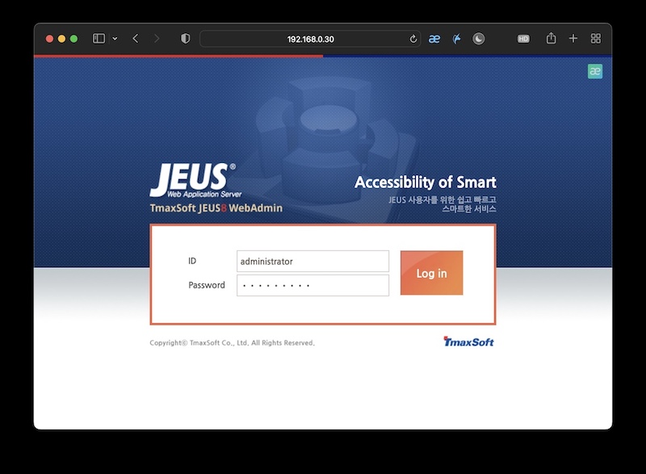
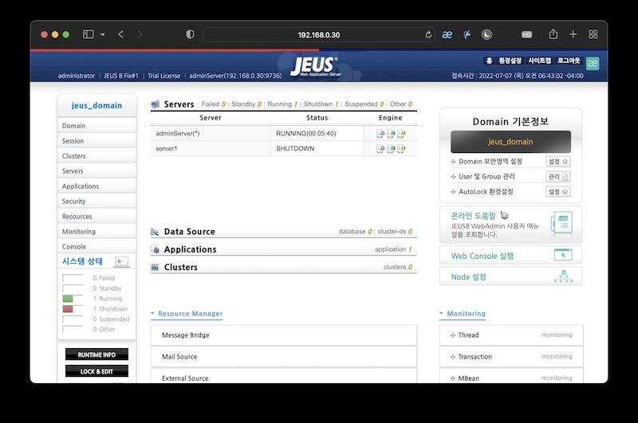
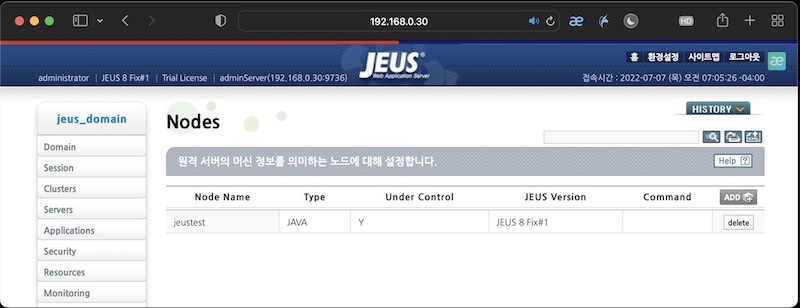
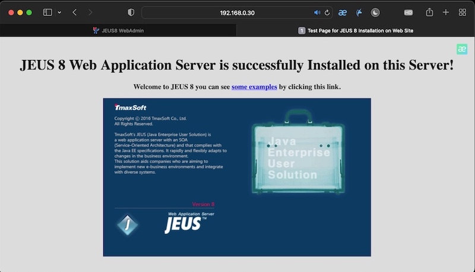

~~너의 주소는.~~

여기서 설명하는 `$JEUS_HOME`은 JEUS가 설치된 경로를 가리킴. 

## 🤔 JEUS란?
* 티맥스소프트에서 개발한 WAS(Web Application Server)
* 주로 동적 데이터(JSP, DB연결 등)를 제공하기 위해 사용. 정적 데이터(HTML, 파일 등)도 제공 가능하나 이건 웹서버인 WebtoB에 맡기는 편.

## 📦 JEUS 구성요소

JEUS는 `Domain / Domain Administration Server / Node Manager / Managed Server / Application`으로 구성됨

* Domain: 관련있는 서버들의 그룹이자 기본 관리 단위.
* DAS(Domain Administration Server): JEUS WebAdmin 접속에 사용되는 관리자용 서버. DAS가 죽더라도 MS가 멀쩡하면 서비스 제공에 아무런 문제가 없음. 노드(서버장비) 여러 대로 이중화를 구성해도 DAS는 하나만 구축함. 둘 이상 구축할 이유가 없음.
* Node Manager: DAS가 MS를 관리하기 위해 사용하는 프로세스
* MS(Managed Server): 작업을 수행하는 프로세스, 인스턴스 또는 컨테이너 같은 것. 흔히 서버라고 부름. MS는 여러 개 생성 가능.
* Application: MS에 의해 제공되는 서비스(HTML, JSP 등)

## 🪪 JEUS 라이선스

JEUS 라이선스 확인은 `$JEUS_HOME/bin/jeusadmin -licenseinfo` 명령어로 확인

* 트라이얼 라이선스는 JEUS 설치 시 기본 적용되는 라이선스. 기간은 무제한이나 접속 수가 최대 5로 제한됨.
* 데모 라이선스는 2개월 간 사용 가능한 라이선스. [https://technet.tmaxsoft.com](https://technet.tmaxsoft.com/) 회원가입 후 발급 가능.
* 스탠더드 라이선스는 세션 클러스터링 불가
* 엔터프라이즈 라이선스는 세션 클러스터링 가능. ~~스탠더드 라이선스 사용중인데 세션 클러스터링이 안 된다는 문의 매우 많다고 함.~~

## 💾 JEUS 설치

테스트에 사용한 서버 OS는 Rocky Linux release 8.5, JAVA는 OpenJDK 1.8.

### JDK 설치

* OpenJDK 1.8을 설치했음에도 JEUS 설치할 때 JDK 1.7 이상의 경로를 선택해야 한다고 뜨는데, 그래도 잘 설치되고 잘 기동되는 것 같음.
* OpenJDK 1.8 설치 명령어: `dnf install java-1.8.0-openjdk`

### 호스트네임 설정

나중에 라이선스 적용하려면 호스트네임 설정 필요.

```html
[root@localhost ~]# hostnamectl set-hostname jeustest  # 호스트네임을 jeustest로 설정
[root@localhost ~]# cat /etc/hostname  # 호스트네임 확인
jeustest
```

### JEUS 설치파일 다운로드 및 실행

* [https://technet.tmaxsoft.com](https://technet.tmaxsoft.com/ko/front/download/viewDownload.do?cmProductCode=0101&version_seq=PVER-20190227-000001&doc_type_cd=DN#binary) 회원가입 후 다운로드 가능
* 여기선 JEUS 8 Fix#1을 다운받아 설치해봄
* 설치파일 실행권한 추가: `chmod u+x jeus8001_unix_generic_ko.bin`
* 설치파일 실행: `./images/jeus8001_unix_generic_ko.bin`

설치할 때 이것저것 물어보는 것이 많은데, 모두 Default 설정을 했다면 아래와 같이 설정되었을 것임

* Domain Name: jeus_domain
* DAS Server Name: adminServer
* JEUS Base Port: 9736
* Admin User Name: administrator
* Admin User Password: 너님이 정한 대로...

## ⚙️ DAS, Node Manager, MS 기동 및 종료

아래에서 설명하는 명령어는 `$JEUS_HOME/bin` 경로에서 실행해야 함.

### DAS 기동

* JEUS WebAdmin 접속을 위한 DAS 기동 명령어는 `./images/startDomainAdminServer -domain jeus_domain -u administrator -p PASSWORD`
* 위 명령어를 매번 치기 귀찮으니  `dsboot.sh` 파일을 만들어 사용하면 편함
* [http://SERVER_IP:9736/webadmin](http://SERVER_IP:9736/webadmin) 주소로 접속되는지 확인.
* 만약 접속되지 않는다면 `systemctl stop firewalld` 명령어로 OS 방화벽을 비활성화한 후, `netstat -an | grep 9736` 명령어로 9736번 포트 LISTENING 상태인지 확인. ~~실습용이니 보안 따위...~~


    
* ID: administrator / PW: 설정한 값 입력하여 잘 로그인되는지 확인



### Node Manager 기동

* DAS가 MS를 제어하기 위한 Node Manager 기동 명령어는 `./images/startNodeManager`
* 위 명령어를 실행하면 백그라운드로 실행되지 않으므로 `$JEUS_HOME/bin` 경로에 `nmboot.sh` 파일을 만들어 `nohup ./images/startNodeManager &` 명령어 넣어서 사용하는 게 좋은 듯.
* JEUS WebAdmin 로그인하여 Node 설정 메뉴에 들어가서 Under Control 값이 Y면 정상 기동된 것



### MS 기동

* MS(Managed Server)는 JEUS WebAdmin의 Servers 메뉴에서 생성, 기동 및 종료 가능
* DAS가 MS를 기동하기 위해 Node Manager가 실행되어 있어야 함
* MS를 실행한 후 해당 MS 이름을 클릭하고 Resource 탭의 Listener 메뉴에 들어가면 http 리스너 포트가 나타남. 이 포트로 접속되는지 확인.




### MS 생성

기존에 있는 MS를 복제하려면 JEUS WebAdmin의 Servers 메뉴에서 `DUP` 버튼을 클릭하여 복제

* 서버 복제 후 기존 서버와 포트 충돌나지 않도록 서버의 Resource 탭에서 리스너 포트를 변경해야 함

새로운 서버를 생성하려면 JEUS WebAdmin의 Servers 메뉴에서 `ADD` 버튼을 클릭하여 생성하면 됨.

* 서버이름 입력 및 Node Name 선택
* JVM Option은 필요 시 입력(예: 힙메모리 설정 `-Xms64m -Xmx128m`)
* Resource 탭에서 리스너 포트 설정 필요. BASE 포트는 필수로 추가해야 하며, HTTP 포트도 추가.
* Engine 탭의 Web Connections에서 HTTP 연결 추가. Server Listener Ref는 Resource 탭에서 만들었던 HTTP 포트를 선택. Thread Pool Size는 대충 20 정도로 입력.

### MS 종료

JEUS WebAdmin의 Servers 메뉴에서 해당 서버 stop

### Node Manager 종료

* Node Manager 종료 명령어는 `./images/stopNodeManager -properties $JEUS_HOME/nodemanager/jeusnm.xml`
* 위 명령어를 매번 치기 귀찮으니 `nmdown.sh` 파일을 만들어 사용하면 편함

### DAS 종료

* DAS 종료: `./images/jeusadmin -host SERVER_IP:9736 -domain jeus_domain -u administrator -p PASSWORD "local-shutdown -to 120”`
* 위 명령어를 매번 치기 귀찮으니 `dsdown.sh` 파일을 만들어 사용하면 편함

## 📱 애플리케이션 배포

위에서 만든 MS를 켠 후 MS의 HTTP 리스너 포트로 접속하면 HTTP 404 에러가 발생함. MS가 뭘 서비스해야 할지 명시하지 않았기 때문.

아무 경로에 myjeusapp 이라는 디렉터리를 만든 후 그 안에 index.html 파일을 만들고 다음과 같이 작성

```html
<html>
<head></head>
<body>Hello JEUS!</body>
</html>
```

JEUS WebAdmin의 Applications 메뉴에서 deploy 버튼 클릭

* ID는 대충 입력, Path는 경로 입력, Target Server는 위에서 만든 MS 선택, Context Path는 / 입력

MS의 HTTP 리스너 포트로 접속하면 Hello JEUS! 가 보일 것임. JSP를 아예 몰라서 HTML로 테스트함...

WAR(Web Application aRchive)도 JEUS WebAdmin의 Applications 메뉴에서 MS로 배포함

## ⬇️ 리소스 추가

예를 들어, JEUS와 DB를 연동하려면 JDBC 드라이버를 리소스로 추가해줘야 함.

* `$JEUS_HOME/lib/datasource` 경로에 JDBC jar 파일 복사
* 추가된 리소스를 인식하기 위해 DAS 재기동
* JEUS WebAdmin의 Resource 메뉴 → DataSource 메뉴에서 JDBC jar 추가

참고로 WAS는 DB와 직접 연동하지 않고 JDBC 드라이버를 통해 연동하므로, 둘이 서로 호환되는지를 알아보려면 둘 다 호환 가능한 JDBC 드라이버 버전이 있는지를 확인해야 함(JEUS 8은 JDBC 드라이버 4.0 버전과 호환됨).

## 📝 로그

### 로그 경로

`$JEUS_HOME/domains/DOMAIN_NAME/servers` 경로에 각각의 MS 로그가 저장됨.

### 로그 파일

* 아래 `$SERVER_HOME`은 `$JEUS_HOME/domains/DOMAIN_NAME/servers` 경로에 있는 각 MS의 경로를 가리킴
* `$SERVER_HOME/logs/servlet/access.log` : 웹 애플리케이션(사용자) 요청에 대한 접근 로그
* `$SERVER_HOME/logs/JeusLauncher.log`: 서버 기동 로그
* `$SERVER_HOME/logs/JeusServer.log`: 서버에서 로깅하는 기본 로그
* `$SERVER_HOME/logs/jvm.log`: 서버 JVM에서 발생하는 로그 메시지

### 로그 형식

로그 형식은 `[시간] [레벨] [Thread 정보] [로그 메시지 ID] [로그 메시지]`

* 기본 레벨은 2(INFO). 5 이상 설정 시 로그가 과도하게 쌓임.
* 장애 발생 시 티맥스 엔지니어 분께 로그 메시지 ID를 알려드리면 빠른 안내를 받을 수 있다고 함.