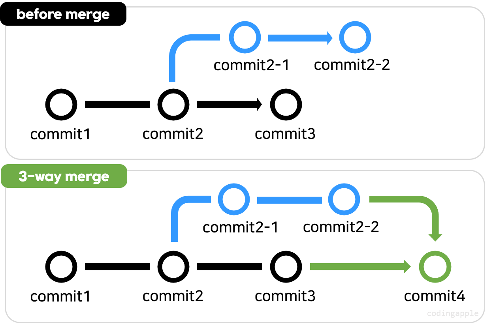
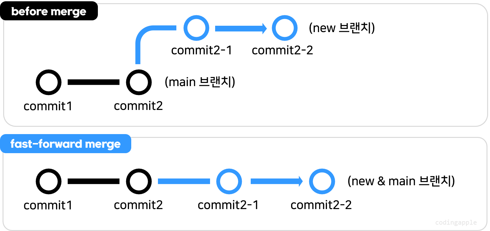
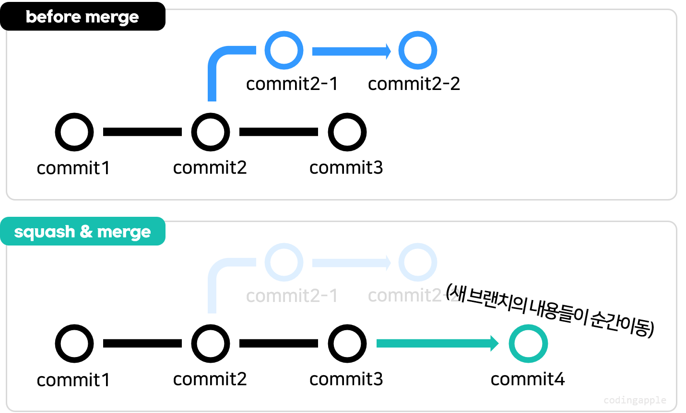
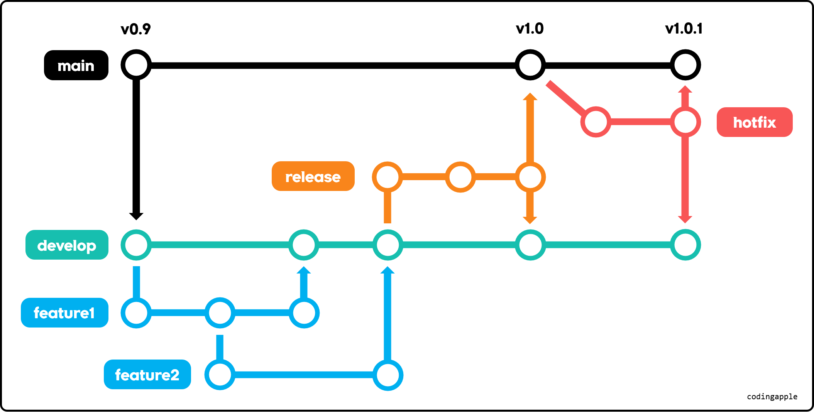

[코딩애플 git & github](https://codingapple.com/course/git-and-github) 강의 듣고 정리한 것들.

## 🤔 Git?

Git은 파일 변경내역을 보존하고 관리하기 위해 사용.

그렇지 않고 이전 내역으로 되돌리려면 최종, 진짜최종, 찐최종, 레알최종 등의 이름으로 파일 복사본을 만들어둬야 함.

## 1️⃣ 초기설정

```shell
# 기본 브랜치 이름을 master가 아닌 main으로 설정
# (GitHub는 기본 브랜치 이름을 main으로 사용하라고 강요하므로 해두는 게 좋음)
$ git config —-global init.defaultBranch main

# 기본 Git의 에디터를 vim이 아닌 vs code로 설정
$ git config —-global core.editor “code —wait”

# 유저 이메일과 이름 설정
$ git config --global user.email "이메일"
$ git config --global user.name "이름"
```

## 스테이징과 커밋

**Add와 Commit 과정을 나눠놓는 이유**는 모든 파일을 기록할 필요가 없으므로(예: 이미지 파일) git add로 기록할 파일을 고르고 git commit으로 고른 파일을 기록저장소로 옮기기 위함임.

**Git을 사용하는 방식은 작업폴더 → Staging area → Repository**
* Staging area는 Commit할 파일을 골라놓는 곳이며, 여기에 파일을 골라넣는 행위를 Staging이라고 함.
* Repository는 Commit된 파일의 버전들을 모아놓은 곳.

```shell
# git 초기화
$ git init

# 스테이징
$ git add 파일명
$ git add 파일명1 파일명2
$ git add .  ## 모든 파일 스테이징 
$ git add *  ## 모든 파일 스테이징 

# 커밋
$ git commit -m '커밋 메시지'

# 상태 출력
$  git status 

# 로그 출력(로그 출력 시 나오는 HEAD가 현재 위치를 가리킴)
$ git log --all --oneline
```

## 🌱 브랜치(Branch) 만들기

브랜치는 메인 줄기에서 뻗어나온 복사본과 같은 것. 여러 개발자들이 협업할 때 자기만의 브랜치를 만들어 테스트 후 잘 된다면 Main 브랜치에 합치는 방식으로 사용.

```shell
$ git branch 브랜치명  # 브랜치 생성
$ git switch 브랜치명  # 해당 브랜치로 이동
$ git status         # 브랜치 확인
$ git log --oneline --all --graph  # 브랜치 구조를 그래프로 출력
```

브랜치를 합치려면 기준이 되는 브랜치로 이동한 후 merge를 수행함.

```shell
$ git switch main   # main 브랜치로 이동한 후
$ git merge 브랜치명  # main 브랜치에 다른 브랜치를 합침
```

main 브랜치와 다른 브랜치에서 같은 파일을 수정한 경우 Merge conflict가 발생함. main 브랜치를 기준으로 병합할지, 다른 브랜치를 기준으로 병합할지 모호하기 때문. 이 때 원하는 코드만 남긴 후 git add 및 git commit을 하면 됨.

## 다양한 Git merge 방법

**3-way merge**는 브랜치를 합쳐서 새로운 commit을 자동으로 생성하는 방식. 기본적인 방식임.

모든 브랜치를 3-way merge 해버리면 복잡해보이며, main 브랜치의 git log 출력 시 3-way merge된 commit 내역도 다 출력돼서 더러워보이는 단점이 있음.



**fast-forward merge는** 신규 브랜치엔 새로운 commit이 있지만 main 브랜치엔 없는 경우 신규 브랜치의 commit을 main으로 지칭하는 방식.

이 방식이 싫으면 `git merge --no-ff 브랜치명` 명령어를 실행해서 강제로 3-way merge를 수행.



**rebase merge** 는 브랜치의 시작점을 다른 commit으로 옮김. 간단하고 짧은 브랜치들은 log 출력 시 깔끔해 보이는 장점이 있지만 conflict가 자주 난다는 단점이 있음.

신규 브랜치의 시작점을 main 브랜치의 최근 commit으로 옮긴 후 fast-forward merge를 하는 경우가 있음. 이렇게 하면 commit 내역을 가지치기 하지 않고 계속 이어나갈 수 있음.

```shell
# rebase & merge 하는 방법
$ git switch 신규브랜치  ## 신규 브랜치로 이동 후
$ git rebase main     ## git rebase main 수행
$ git switch main     ## main 브랜치로 이동후 
$ git merge 신규브랜치   ## fast-forward merge 수행
```


**squash merge**는 새 브랜치에 있던 코드 변경사항들을 main 브랜치로 순간이동하는 방식.



```shell
# squash & merge 방법
$ git switch main            ## main 브랜치로 이동 후
$ git merge --squash 브랜치명  ## squash & merge 수행
$ git commit -m "메시지"       ## 새 브랜치의 내용들이 순간이동
```

**브랜치 삭제**

```shell
$ git branch -d 브랜치명  # merge 완료된 브랜치 삭제
$ git branch -D 브랜치명  # merge 안 한 브랜치 삭제
```


## 🔙 되돌아가기

**파일 하나를 되돌리려면 git restore**

```shell
$ git restore 파일명                   ## 최근 commit된 상태의 파일로 되돌리기
$ git restore --source 커밋아이디 파일명  ## 특정 커밋 아이디 시점으로 파일 되돌리기
$ git restore --staged 파일명          ## 스테이징 취소하기
```

**commit을 되돌리려면 git revert**

* revert 하면 commit을 없애는 게 아니고 commit을 취소한 commit을 생성함.
* revert 할 때 여러 개의 commit ID를 입력할 수 있음.

```shell
$ git revert 커밋아이디  ## 특정 commit으로 되돌리기
$ git revert HEAD     ## 최근 commit으로 되돌리기
```

**전부 되돌리고 싶으면 git reset**

reset 하면 그 이후 commit은 사라짐

```shell
# 특정 commit으로 되돌리기
## --hard 옵션: 특정 commit 이후에 생성된 파일이 삭제됨
## --soft 옵션: 파일이 삭제되지 않고 Staging area에 남음
## --mixed 옵션: 파일이 삭제되지 않고 Staging 되지 않은 상태가 됨
$ git reset --hard 커밋아이디
```


## GitHub 사용법

Git이 파일 기록해두는 장소가 리포지토리(Repository)이며, GitHub는 온라인 리포지토리.

GitHub는 기본 브랜치 이름을 main으로 사용하라고 강요하므로 `git branch -M main` 명령어로 기본 브랜치 이름을 변경해야 함.

원격저장소에 올리지 않는 파일이나 폴더들은 `.gitignore` 파일에 명시

**로컬에서 GitHub 원격저장소로 올리기**

```shell
# 로컬에서 GitHub 원격저장소로 업로드
$ git push -u 원격저장소주소 브랜치명  ## -u 옵션은 방금 입력한 주소를 기억하는 옵션. 다음부터는 `git push`만 입력해도 됨.
$ git push origin 브랜치명         ## main 브랜치가 아닌 브랜치를 push
```

**리포지토리 주소 길게 입력하는게 귀찮으면?** 주소를 변수에 저장하여 사용하면 됨.

```shell
$ git remote add 변수명 원격저장소주소    ## 변수 지정
$ git remote add origin 원격저장소주소  ## 보통 origin 변수에 리포지토리 주소 저장
$ git remote -v                     ## 변수 목록 출력
```

### 타인과 협업하기(git clone, pull)

**원격저장소 복제하기**

* `git clone 원격저장소주소` 명령어로 원격저장소 그대로 내려받은 후 commit 하고 push 하면 됨. 다만 GitHub 원격저장소 Settings의 Collaborator에 계정이 등록되어 있어야 함.
* 원격저장소에 타인이 새로운 commit을 만들면 나는 git push를 못 함. 원격저장소의 최신 commit이 나의 로컬저장소에 있을 때만 git push가 가능함.
* `git pull 원격저장소주소` 명령어로 원격저장소의 모든 브랜치 내용을 로컬저장소에 합칠 수 있음. `-u` 옵션을 사용했다면 그 이후에 `git pull` 만 사용해도 됨.
* git pull은 git fetch(원격저장소 신규 commit 가져오세요) + git merge(내 브랜치에 merge 해주세요) 이므로 conflict가 발생할 수 있음.

### 타인과 협업하기(Pull request)

개발자가 많아지면 개발자마다 브랜치를 만들어서 개발 후 merge함. 

GitHub에서 브랜치를 만드려면 main 브랜치명 버튼 클릭 후 이름을 입력하여 만듦.

GitHub에서 merge 하려면 Pull request를 사용. Pull request 시 내 브랜치좀 merge 해달라는 요청을 할 수 있고, merge 전에 팀원끼리 코드 검토가 가능함.

1. 원격저장소 Pull requests 메뉴 → New pull request 버튼 클릭 → base, compare 브랜치 선택 후 Create pull request 버튼 클릭하면 pull request가 열림
2. 이후 팀원끼리 검토, 토론을 할 수 있음
3. 문제 없다면 Merge pull request 버튼 클릭 → merge 옵션(기본, Squash, Rebase) 선택 후 merge 수행


## 브랜치 전략

**GitFlow 전략**은 main, develop, feature, release, hotfix 5개의 브랜치를 운영하는 방법.

* main은 서비스 중인 코드 저장
* 신기능 개발 시 develop 브랜치를 만든 후 프로젝트 사본 복사
* feature 브랜치를 develop 브랜치에 만들어 개발해보고, 잘 되면 develop 브랜치에 merge. (feeature/이름 형식으로 작명하는 경우가 흔함)
* release 브랜치를 develop 브랜치에 만들어 테스트해보고, 고칠게 있으면 수정하며 테스트 후 문제 없으면 main, develop 브랜치에 merge.
* hotfix 브랜치를 만들어 치명적인 버그 수정 후 main, develop 브랜치에 merge.

안정적으로 버전별 배포 가능하나, CI/CD 이런거 하는 곳은 안 좋아함. 굳이 똑같이 따라할 필요없으며, 상황에 맞게 변경하여 사용.



**Trunk-based 전략**은 브랜치 하나만 잘 관리하자는 전략. 새로운 기능이 필요하면 그 때마다 feature 브랜치를 만든 후 main 브랜치에 합침.

브랜치 종류가 많지 않고 소스코드가 한 곳에 있어 간편하나, 테스트를 많이 해야 함.


## 코드 잠깐 보관하기

git stash를 사용하면 코드 내용 일부를 잠시 잘라 보관할 수 있음. 주석 내용을 숨기고 commit하고 싶을 때 유용.

Staging된 파일 내용 일부를 삭제 및 저장한 후 `git stash` 명령어를 실행하면 삭제된 내용이 다른 공간에 보관됨. 이 때 Staging된 파일이든 아니든 추적 중인 파일은 다 이동되며, 새로 만든 파일이지만 Staging 안 되었다면 이동되지 않음.

```shell
$ git stash              ## 수정 사항 stash
$ git stash save "메모"   ## 메모를 남기며 stash
$ git stash list         ## stash 리스트 출력
$ git stash pop          ## 가장 최근 stash한 내용 불러오기
$ git stash drop 삭제할ID  ## 특정 stash 리스트 삭제
$ git stash clear        ## 모든 stash 리스트 삭제
```