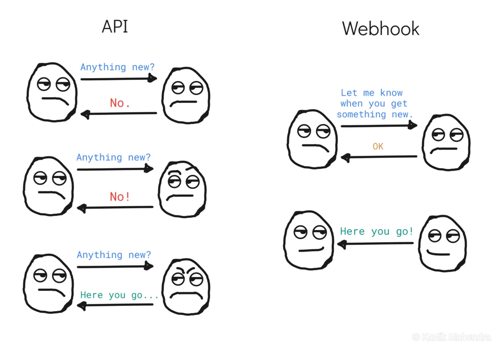

트레이딩뷰 파인 스크립트로 포지션 매수 타이밍을 계산하고 이를 웹훅(Webhook)으로 서버에 알리면 자동 매수 애플리케이션을 만들 수 있지 않을까 생각되어 만들어본 파이썬 코드. 문제는... 적절한 매수 타이밍을 도저히 계산할 수가 없다... 😭

파이썬 Flask 웹 서버를 사용하여 트레이딩뷰 웹훅 메시지를 받아 처리하는 코드를 정리한 글입니다.


## ⏰ 트레이딩뷰 웹훅 알림 설정

1. 얼러트 메뉴에서 알림 조건을 적절히 설정한 후 메시지에 JSON 데이터를 작성합니다. 트레이딩뷰에서 제공하는 변수를 쓸 수 있고 원하는 메시지를 작성할 수도 있습니다.

```json
{
  "ticker": "{{ticker}}",
  "close": "{{close}}",
  "open": "{{open}}",
  "high": "{{high}}",
  "low": "{{low}}",
  "volume": "{{volume}}",
  "time": "{{time}}",
  "msg": "Custom trading view message"
}
```

2. 알림 탭의 웹훅 URL 항목에 웹훅 메시지를 받을 서버의 웹 주소를 입력합니다. 이 때 웹 서버의 http(s) 접속 포트는 반드시 80(443)이어야 합니다.


## 🧑‍💻 Flask 웹 서버 구축

먼저 `pip3 install flask` 명령어로 Flask 패키지를 설치합니다.

### Hello World 서버 구축

Flask 서버 구축은 처음이므로 접속 시 Hello World! 메시지를 출력하는 Flask 서버를 생성해봅니다. 🙂

```python
from flask import Flask, request, jsonify

app = Flask(__name__)

@app.route('/')
def hello_world():
    return 'Hello World!'

if __name__ == '__main__':
    app.run(debug=True, host="0.0.0.0", port=80)
```

### 트레이딩뷰 서버만 접속 허용하기

엉뚱한 곳에서 웹훅 메시지를 보내면 큰일(😅?) 나므로 트레이딩뷰 IP 4개만 접속을 허용해줍니다.

```python
# 트레이딩뷰 서버만 접속 허용
ALLOWED_IPS = ["52.89.214.238", "34.212.75.30", "54.218.53.128", "52.32.178.7"]

@app.before_request
def limit_remote_addr():
    client_ip = request.remote_addr
    if client_ip not in ALLOWED_IPS:
        return jsonify({"status": "failure", "message": "Access denied."}), 403
```

### 웹훅 메시지 전달받아 처리하기

전달 받은 웹훅 메시지는 딕셔너리 자료형에 맞게 처리하면 됩니다. 😎

```python
# http://SERVER_IP/webhook 주소로 POST 요청 받기
@app.route('/webhook', methods=['POST'])
def webhook():
    if request.method == 'POST':
        data = request.json             # 전송받은 데이터는
        print(f"Time: {data['time']}")  # 딕셔너리 자료형에 맞게 처리
        print(f"Ticker: {data['ticker']}")
        print(f"Open: {data['open']}")
        print(f"High: {data['high']}")
        print(f"Low: {data['high']}")
        print(f"Volume: {data['volume']}")
        print(f"Message: {data['msg']}")
        return jsonify({"status": "success"}), 200
    else:
        return jsonify({"status": "failure", "message": "Invalid request method"}), 400
```

### 전체 코드

```python
from flask import Flask, request, jsonify

app = Flask(__name__)

# 트레이딩뷰 서버만 접속 허용
ALLOWED_IPS = ["52.89.214.238", "34.212.75.30", "54.218.53.128", "52.32.178.7"]

@app.before_request
def limit_remote_addr():
    client_ip = request.remote_addr
    if client_ip not in ALLOWED_IPS:
        return jsonify({"status": "failure", "message": "Access denied."}), 403

# @app.route('/')
# def hello_world():
#     return 'Hello World!'

@app.route('/webhook', methods=['POST'])
def webhook():
    if request.method == 'POST':
        data = request.json             # 전송받은 데이터는
        print(f"Time: {data['time']}")  # 딕셔너리 자료형에 맞게 처리
        print(f"Ticker: {data['ticker']}")
        print(f"Open: {data['open']}")
        print(f"High: {data['high']}")
        print(f"Low: {data['high']}")
        print(f"Volume: {data['volume']}")
        print(f"Message: {data['msg']}")
        return jsonify({"status": "success"}), 200
    else:
        return jsonify({"status": "failure", "message": "Invalid request method"}), 400

if __name__ == '__main__':
    app.run(debug=True, host="0.0.0.0", port=80)
```