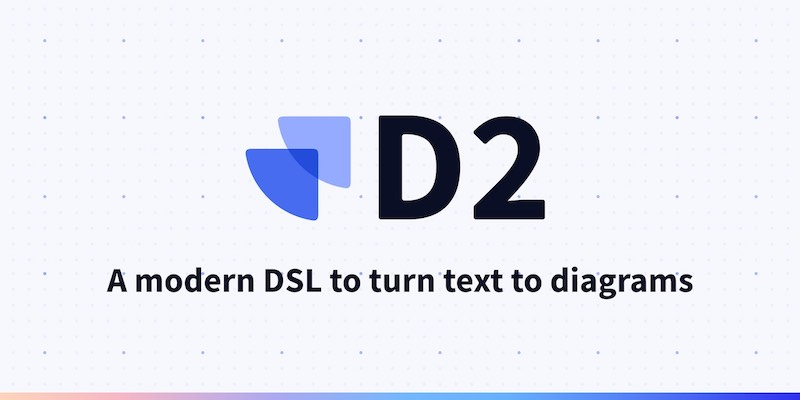

## 🧐 D2 언어란?

D2 언어는 스크립트를 도표(다이어그램)로 바꿔주는 언어입니다. 아키텍처, 그래프 등을 일일이 손으로 그릴 필요 없이 스크립트를 작성하면 이에 맞는 svg 또는 png 파일을 생성해 줍니다.

요소들을 원하는 곳에 배치하는 게 좀 애매하긴 하지만, 파워포인트나 비쥬얼 빌더 등으로 도표를 그리는 것보다 빠르게 그릴 수 있어 매우 좋습니다.

D2 언어에 대한 소개 및 사용 방법은 [https://d2lang.com](https://d2lang.com) 사이트에서 확인할 수 있으며, 치트 시트는 [이곳](https://terrastruct-site-assets.s3.us-west-1.amazonaws.com/documents/d2_cheat_sheet.pdf)을 참고합니다.


## 📥 설치 & 삭제

MacOS에서는 `curl -fsSL https://d2lang.com/install.sh | sh -s --` 명령어를 실행하여 설치합니다. 삭제하려는 경우 `curl -fsSL https://d2lang.com/install.sh | sh -s -- --uninstall` 명령어를 실행합니다.

윈도우에서는 [https://github.com/terrastruct/d2/releases](https://github.com/terrastruct/d2/releases) 에서 설치파일을 다운로드 후 설치합니다.


## 🆕 Hello World!

아래와 같이 작성한 후 test.d2 이름으로 저장합니다. 주석을 작성하려면 맨 앞에 `#`를 붙입니다.

```text
# 아래와 같이 작성 후 test.d2 이름으로 저장
x -> y: Hello World!
```

`d2 test.d2` 명령어를 실행하면 test.svg 파일이 생성됩니다. 이 파일을 열어보면 다이어그램을 확인할 수 있습니다.


## 🖥️ 주요 명령어

```shell
# 웹 브라우저를 통해 작성 내용을 변경할 때마다 다이어그램 확인
$ d2 --watch=true test.d2

# png 파일로 저장
$ d2 test.d2 test.png

# 스케치 테마 적용
$ d2 test.d2 --sketch
```


## 💠 형태(Shapes)

다이어그램에 나타나는 요소들을 형태(Shapes)라고 부릅니다. 형태는 키 값을 입력하여 선언합니다.

```text
imAshape # 키 값이 imAshape인 형태 선언
i'm a-shape # ', - 및 공백 사용 가능
```

기본적으로 형태의 라벨(Label)은 키 값과 동일합니다. 라벨을 따로 붙이려면 키 값 뒤에 콜론(`:`)을 붙입니다.

```text
# 키 값은 py, 이름은 Phtyon인 형태 선언
py: Python
```

형태의 기본 타입은 사각형(Rectangle) 입니다. 형태의 shape 속성 값을 변경하면 타입을 변경할 수 있습니다.

* 타입 종류: rectangle, square, page, parallelogram, document, cylinder, queue, package, step, callout, stored_data, person, diamond, oval, circle, hexagon, cloud
* 특별 타입: text, code, class sql_table, image, sequence_diagram

```text
Cloud: My cloud
Cloud.shape: cloud
```

## ➡️ 연결(Connections)

형태와 형태는 서로 연결할 수 있으며, `--`, `<-`, `->`, `<->` 를 사용합니다. 연결에도 라벨을 붙일 수 있습니다.

```text
# 2개의 형태끼리 연결
A -- B
A <- B
A -> B
A <-> B

# 3개 이상을 한 번에 연결하거나 순환 연결도 가능함
A -> B -> C -> A: Cycle

# 연결에 Service request라는 이름 부여
Client -> Server: Service request 
```


## 📦 컨테이너(Containers)

또 다른 형태를 포함한 형태를 컨테이너라고 합니다.

```text
# Nested syntax를 사용하지 않고 DB 컨테이너 선언
DB: 데이터베이스
DB.Oracle: 오라클
DB.MariaDB: 마리아DB

# Nested syntax를 사용하여 DB 컨테이너 선언
DB: 데이터베이스 {
  Oracle: 오라클
  MariaDB: 마리아DB
}

DB {
  label: 데이터베이스 # label 예약어를 사용하여 컨테이너 이름 지정 가능
  Oracle: 오라클
  MariaDB: 마리아DB
}
```

## 💡 특별 객체(Special Objects)

### 텍스트 & 코드

마크다운을 입력하려면 키 값 뒤에 `|md`를 붙입니다.

```text
explanation: |md
  # Title
    * content
|
```

LaTeX 수식을 입력하려면 키 값 뒤에 `|tex` 또는 `|latex`를 붙입니다.

```text
plankton -> formula: will steal
formula: {
  equation: |latex
    \\lim_{h \\rightarrow 0 } \\frac{f(x+h)-f(x)}{h}
  |
}
```

마크다운과 LaTeX 형태를 어느 형태 근처에 둘지 near 속성을 추가하여 설정할 수 있습니다. near 속성 값에 근처에 둘 형태의 키 값을 넣거나 아래 상수값을 넣습니다.
* near 속성 상수값: top-left, top-center, top-right, center-left, center-right, bottom-left, bottom-center, bottom-right

```text
aws: {
  load_balancer -> api
  api -> db
}
gcloud: {
  auth -> db
}

gcloud -> aws

explanation: |md
  # Why do we use AWS?
  - It has more uptime than GCloud
  - We have free credits
| {
  near: aws # explanation을 aws 근처에 배치
}
```

### 아이콘

```text
my network: {
  icon: https://icons.terrastruct.com/infra/019-network.svg
}
```

### 이미지

```text
server: {
  shape: image
  icon: https://icons.terrastruct.com/tech/022-server.svg
}
```

## 🤪 커스텀(Customization)

### 테마(Themes)

d2 명령어에 `-t [THEME_ID]` 또는 `--theme [THEME_ID]` 플래그를 사용하여 테마를 설정합니다. THEME_ID 값은 [이곳](https://d2lang.com/assets/images/theme_1-973ca3b84f78e3332f3b589288691e06.png)을 참고합니다.

```text
# 테마 ID 101번 사용
$ d2 -t 101 input.d2 out.svg
$ d2 -theme 101 input.d2 out.svg
```

### 스타일(Styles)

형태의 style 속성을 사용합니다.

```text
A {
  style: {
    opacity: 0.4         # 투명도
    stroke: deepskyblue  # 선 색(CSS 컬러 이름 또는 hex값)
    fill: "f4a261"       # 배경 색(CSS 컬러 이름 또는 hex값)
    stroke-width: 8      # 선 두께(1 ~ 15)
    stroke-dash: 3       # 대시 선(0 ~ 10)
    border-radius: 3     # 테두리 반경(0 ~ 20)
    shadow: true         # 그림자(true or false)
    multiple: true       # 3D 효과(true of false)
    font-size: 28        # 글씨 크기(8 ~ 100)
    font-color: red      # 글씨 색(CSS 컬러 이름 또는 hex값)
    animated: true       # 애니메이션 효과(true or false)
    bold: true           # 진한 글씨체(true or false)
    italic: true         # 이탤릭체(true or false)
    underline: true      #  밑줄(true or false)
  }
}
```

### 크기 조절(Dimensions)

컨테이너가 아닌 형태의 너비 및 높이를 설정할 수 있습니다.

```text
small jerry: "" {
  shape: image
  icon: https://static.wikia.nocookie.net/tomandjerry/images/4/46/JerryJumbo3-1-.jpg
  width: 200
  height: 200
}
```

### 대화형(interactive)

형태의 우측 상단에 툴팁과 링크를 달 수 있습니다.

```text
apple: { 
  tooltip: Apple
  link: https://apple.com
}
```


## 참고 사이트

* [D2 Documentation](https://d2lang.com)
* [D2 언어 사용해보기](https://velog.io/@sihyeong671/D2-언어-사용해보기)