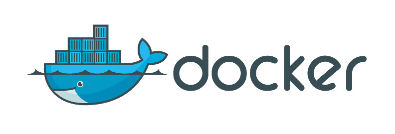
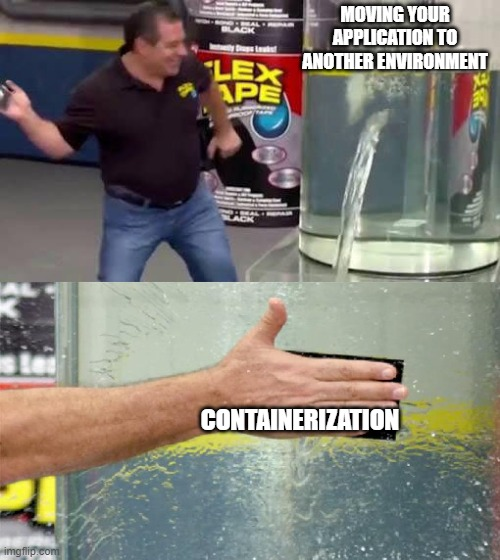
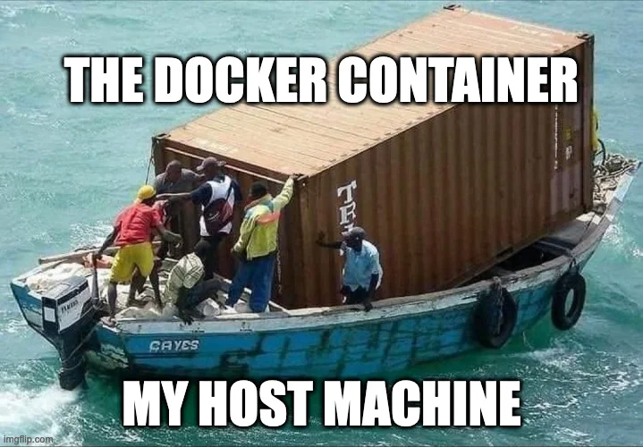

[따배도 도커 시리즈 강의](https://www.youtube.com/watch?v=NLUugLQ8unM&list=PLApuRlvrZKogb78kKq1wRvrjg1VMwYrvi)랑 여기저기서 주워들은 것들을 정리한 내용들.

## 🤔 도커(Docker)란?

도커(Docker)는 컨테이너 기술을 사용하여 애플리케이션을 배포, 운영 및 관리하는 플랫폼.

### 특징



* 컨테이너화: 컨테이너는 애플리케이션과 의존성 파일들(소 스코드, 라이브러리 등)을 하나의 묶은 것. **컨테이너는 도커 실행이 가능한 환경에서 어디서든 실행할 수 있음.**
* 이식성: 컨테이너는 운영체제에 독립적임. 이미지(컨테이너)와 볼륨만 백업하면 **어느 환경에서든 동일하게 작동하므로 애플리케이션 개발 및 배포가 용이해짐.**
* 효율성: 가상 머신에 비해 더 빠르고 경량화된 환경 제공.
* 확장성: 도커 컴포즈 또는 기타 오케스트레이션 도구(쿠버네티스)를 사용하여 컨테이너 배포 및 관리를 용이하게 할 수 있음.

### 주요 용어

* 컨테이너 이미지(이하 이미지): 애플리케이션과 의존성 파일들을 모아놓은 템플릿
* 컨테이너: 이미지에 의해 만들어진 인스턴스
* 도커 허브: 도커 이미지들을 다운받을 수 있는 원격 저장소
* 도커 컴포즈: 여러 컨테이너를 일괄적으로 정의하고 실행할 수 있는 도구


## 🤗 Hello Docker!

### Docker 설치

https://docs.docker.com/engine/install/ 참고

### Hello World!

`docker run hello-world` 명령어 실행하면 됨.


## 📦 이미지와 컨테이너 살펴보기

이미지는 내부 파일들이 영구적으로 보존되며 읽기 전용임.

컨테이너는 읽기 쓰기 모두 가능하지만, 컨테이너가 생성된 후 저장된 데이터는 컨테이너가 삭제되면 보존되지 않음. 이를 해결하려면 볼륨을 사용해야 함. (뒤에서 자세히 설명)

### 이미지 검색

```shell
# Docker Hub에서 이미지 검색
$ docker search IMAGE_NAME

# Docker Hub에서 이미지 다운로드
$ docker pull IMAGE_NAME:TAG

# 저장된 이미지 검색
$ docker image ls
$ docker images
$ docker images --no-trunc  ## 이미지 ID를 자르지 않고 전부 출력
```

### 컨테이너 실행

```shell
# 이미지 컨테이너화(실행하진 않음)
$ docker create --name CONTAINER_NAME IMAGE_NAME:TAG

# 컨테이너화된 이미지 실행
$ docker start CONTAINER_NAME

# 컨테이너 실행(이미지가 없으면 다운로드받아 실행까지 함)
$ docker run \
--name CONTAINER_NAME \        ## 이 이름으로 컨테이너화
-p HOST_PORT:CONTAINER_PORT \  ## 포트 매핑
-d IMAGE_NAME:TAG              ## -d: 백그라운드 모드로 실행
```

### 이미지 및 컨테이너 관리

```shell
# 포그라운드로 실행 중인 컨테이너 연결
$ docker attach [OPTIONS] CONTAINER_NAME

# 동작 중인 도커 컨테이너 출력
$ docker container ls
$ docker ps     ## 기동 중인 컨테이너 출력
$ docker ps -a  ## 중지된 컨테이너도 출력

$ docker top CONTAINER_NAME      ## 컨테이너에 작동 중인 프로세스 출력
$ docker logs CONTAINER_NAME     ## 컨테이너 로그 조회
$ docker logs -f CONTAINER_NAME  ## 컨테이너 로그를 실시간 조회
$ docker exec CONTAINER_NAME COMMAND        ## 컨테이너 내 명령어 실행
$ docker exec -it CONTAINER_NAME /bin/bash  ## 컨테이너 셸 실행(Interactive, Terminal)

# 상세 정보 출력
$ docker inspect IMAGE_NAME:TAG
$ docker inspect CONTAINER_NAME
$ docker inspect --format '{{.NetworkSettings.IPAddress}}' CONTAINER_NAME  ## 컨테이너의 NetworkSettings.IPAdress 속성 출력
```

### 컨테이너 종료 및 이미지 제거

```shell
# 컨테이너 종료
$ docker stop CONTAINER_NAME     ## 컨테이너 중지
$ docker start CONTAINER_NAME    ## 중지된 컨테이너 시작
$ docker restart CONTAINER_NAME  ## 컨테이너 재시작

# 컨테이너 제거
$ docker rm IMAGE_NAME     ## 실행 중인 컨테이너는 제거하지 않음
$ docker rm -f IMAGE_NAME  ## 실행 중인 컨테이너도 강제 종료 후 제거

# 이미지 제거
$ docker rm image IMAGE_NAME
$ docker rmi IMAGE_NAME
```


## 🙌 Dockerfile로 이미지 직접 만들기



Dockerfile을 이용해 이미지를 빌드할 수 있음.

```dockerfile
# Dockerfile 예시
FROM node:20
LABEL maintainer="Jeon Won <https://jeonwon.dev>"
COPY hello.js /
CMD ["node", "hello.js"]
```

### Dockerfile 주요 문법

* `#`: 주석
* `FROM`: Base image. 가장 먼저 나와야 함.
* `LABEL`: Key-Value 형식의 메타데이터. `MAINTAINER`는 Deprecated됨.
* `RUN`: Base image에서 실행할 명령어들
* `COPY`: 호스트의 파일을 컨테이너로 복사
* `ADD`: 호스트의 파일을 컨테이너로 복사. COPY와의 차이점은...
	- 압축 파일(tar, tar.gz)인 경우 압축을 해제하여 복사해줌
	- wget 등을 통해 원격지의 파일을 복사 대상으로 지정할 수 있음
* `WORKDIR`: 명령이 실행될 작업 디렉터리 설정
* `ENV`: 환경변수 지정
* `USER`: 컨테이너 실행 시 적용할 유저 설정
* `VOLUME`: 파일 또는 디렉터리를 컨테이너의 디렉터리로 마운트. 애플리케이션 데이터가 영구적으로 저장되는 경로로 사용.
* `EXPOSE`: 외부에서 사용할 포트 지정
* `CMD`: 자동으로 실행할 서비스나 스크립트 지정. 컨테이너 실행 시 변경 가능.
* `ENTRYPOINT`: CMD와 함께 사용하면서 커맨드 지정 시 사용. 컨테이너 실행 시 변경 불가.

### Dockerfile 빌드

`docker build -t DOCKER_HUB_ID/IMAGE_NAME:TAG_NAME .` 명령어를 실행하면 이미지가 생성됨.
* Docker Hub에 배포하지 않는다면 `DOCKER_HUB_ID/` 부분은 제거해도 무방. 
* `.`은 현재 경로에 있는 Dockerfile을 가리킴. 다른 경로에 있다면 `.` 대신 `-f DOCKERFILE_PATH`를 입력해주면 됨.


## 🚀 이미지 배포하기

로컬에 저장된 이미지는 공개 저장소인 [도커 허브(Docker Hub)](https://hub.docker.com)나 비공개 저장소에 배포할 수 있음.

**참고로, 도커 허브에 등록된 이미지는 여러 종류가 있음.**

* Official Images: 도커 허브에서 직접 관리하는 이미지
* Verified Publisher: 벤더사에서 관리하는 이미지
* 그 외 개인이 공개 설정한 이미지 등

### 이미지 태그명 변경

이미지 태그명에 도커 허브 ID가 명시되지 않으면 도커 허브로 이미지를 배포할 수 없음. 이 경우 `docker tag CONTAINER_NAME:TAG_NAME DOCKER_HUB_NAME/CONTAINER_NAME:TAG_NAME` 명령어로 수정 후 배포해야 함.

### 도커 허브에 이미지 배포

```shell
# 도커 허브 로그인
$ docker login

# 도커 허브로 이미지 배포(TAG_NAME이 latest인 경우 생략 가능)
$ docker push DOCKER_HUB_ID/IMAGE_NAME:TAG_NAME
```

### 비공개 저장소 구축

registry 컨테이너를 사용하면 Private Registry를 구축할 수 있음. 아래 명령어 실행.

```shell
$ docker run -d \
-p 5000:5000 \
--restart always \
--name registry \
registry:VERSION  # VERSION은 주로 2를 사용(?)
```

registry 컨테이너에 이미지를 배포하려면 `docker tag CONTAINER_NAME:TAG_NAME localhost:5000/CONTAINER_NAME:TAG_NAME` 명령어 실행. registry 컨테이너에 배포하기 위해 이미지 태그를 바꾸는 것이므로 앞뒤 컨테이너, 태그 네임은 서로 달라도 됨.

registry 컨테이너로 이미지를 배포하려면 `docker push localhost:5000/CONTAINER_NAME:TAG_NAME` 명령어 실행.

### 이미지를 로컬에 백업 및 복원

```shell
# 컨테이너를 이미지로 저장
$ docker commit -p CONTAINER_NAME IMAGE_NAME  ## 컨테이너가 IMAGE_NAME 이름으로 로컬에 이미지로 저장됨

$ 이미지 백업
$ docker save -o /PATH/TO/BACKUP_NAME.tar IMAGE_NAME           ## tar 파일로 저장
$ docker save IMAGE_NAME | gzip > /PATH/TO/BACKUP_NAME.tar.gz  ## 압축하여 저장

# 이미지 복원
$ docker load < BACKUP_NAME.tar
$ docker load < BACKUP_NAME.tar.gz
```


## 🛠️ 컨테이너 리소스 관리

기본적으로 컨테이너는 호스트 하드웨어 리소스의 사용 제한을 받지 않음.

### 메모리(RAM) 리소스 제한

```shell
$ docker run -d \
-m 512m \                    ## 메모리 제한: 단위는 b, k, m, g로 할당
--memory-reservation 500m \  ## 적어도 500MB 메모리 사용 보장
--memory-swap 1g \           ## 메모리 스왑 사이즈. 생략 시 메모리의 2배로 설정됨.
--oom-kill-disable \         ## OOM Killer(물리 메모리 부족 시 리눅스 커널이 가동하는 프로세스)가 프로세스를 kill 하지 못하도록 보호
CONTAINER_NAME
```

### CPU 리소스 제한

```shell
$ docker run -d \
--cpus=".5" \        ## 최대 0.5개의 CPU 코어 파워 사용 가능
--cpuset-cpus=0-3 \  ## 사용 가능한 CPU나 코어 할당(CPU Index는 0부터)
--cpuset-cpus=0 \    ## 0번 CPU 코어만 사용
--cpu-share 2048 \   ## CPU 비중을 다른 컨테이너보다 2배 설정(1배 기준: 1024)
CONTAINER_NAME
```

### Block I/O 리소스 제한

```shell
$ docker run -d \
--blkio-weight 100                ## Block IO의 Quota 설정. 100~1000까지 선택. 기본 500. 
--device-read-bps /dev/vda:10mb   ## 특정 디바이스 읽기 속도의 초당 제한(단위: kb, mb, gb)
--device-write-bps /dev/vda:10mb  ## 특정 디바이스 읽기 속도의 초당 제한(단위: kb, mb, gb)
--device-read-iops /dev/vda:10    ## 특정 디바이스 읽기 속도 Quota 설정
--device-write-iops /dev/vda:10   ## 특정 디바이스 쓰기 속도 Quota 설정
CONTAINER_NAME
```

### 리소스 모니터링

```shell
# 런타임 통계 확인
$ docker stats                 ## 실행 중인 모든 컨테이너 확인
$ docker stats CONTAINER_NAME  ## 특정 컨테이너 확인

# 이벤트 정보 확인
$ docker events
$ docker events -f container=CONTAINER_NAME
```

위의 모니터링 명령어 외에 [cAdvisor](https://github.com/google/cadvisor)를 사용할 수도 있음.


## 🗂️ 컨테이너 볼륨


컨테이너가 생성된 후 저장되는 데이터를 영구적으로 보존하려면 컨테이너 볼륨을 사용해야 함. 디렉터리 경로만이 아닌 파일만도 마운트할 수 있음.

동일한 볼륨을 여러 컨테이너에 마운트하여 사용할 수 있음. 이렇게 하면 컨테이너끼리 데이터 공유가 가능함. (예: 특정 컨테이너가 만든 파일을 웹 서버 컨테이너가 Read Only 형식으로 접근하도록 구현)

### 볼륨을 생성한 후 컨테이너에 마운트

도커 볼륨을 생성하면 기본적으로 `/var/lib/docker/volumes/` 경로에 디렉터리가 생성되며, 이 하위 디렉터리에 데이터가 저장됨.

```shell
# 도커 볼륨 생성
$ docker volume create VOLUME_NAME

# 컨테이너 실행 시 생성된 볼륨 마운트
$ docker run -d \
-v VOLUME_NAME_1:/CONTAINER/MOUNT/PATH_1 \
-v VOLUME_NAME_2:/CONTAINER/MOUNT/PATH_2:ro \  ## :ro를 붙이면 Read Only 볼륨
... 생략
```

### 로컬 경로를 컨테이너에 마운트

도커 볼륨을 만들지 않고 로컬 경로를 직접 컨테이너에 마운트 할 수 있음.

```shell
$ docker run -d \
-v /LOCALHOST/PATH_1:/CONTAINER/MOUNT/PATH_1 \
-v /LOCALHOST/PATH_2:/CONTAINER/MOUNT/PATH_2:ro \
... 생략
```


## 🌐 컨테이너 네트워크


### 컨테이너 포트

컨테이너 포트는 포트 포워딩을 통해 호스트 포트와 매핑하여 사용됨.

```shell
# 컨테이너 실행 시 포트 포워딩 설정
$ docker run -p HOST_PORT:CONTAINER_PORT 
$ docker run -p random:CONTAINER_PORT  ## 호스트의 random 포트 사용
$ docker run -P  ## Dockerfile에서 정의한 EXPOSE 값에 따라 포트 사용

# 포트포워딩 설정 조회
$ iptables -t nat -L -n -v
```

### 도커 기본 네트워크(docker0)

docker0는 도커의 기본 브릿지 네트워크 인터페이스. 도커 데몬이 실행되면 docker0(172.17.0.1)이 가상 이더넷 브릿지를 생성함.

docker0는 여러 컨테이너의 게이트웨이 역할을 함. 즉 모든 컨테이너는 docker0를 통해 외부 통신을 수행함.

### 커스텀 네트워크

도커 기본 네트워크를 사용하면 컨테이너의 IP 고정이 안 됨. 컨테이너의 IP를 고정하려면 커스텀 네트워크를 사용해야 함.

```shell
# 커스텀 네트워크 생성
$ docker network create \
--driver bridge \            ## 커스텀 브릿지 네트워크
--subnet 192.168.100.0/24 \  ## 서브넷 생략 시 기본(172.17.0.0)의 다음 대역(172.18.0.0)으로 설정됨
--gateway 192.168.100.1 \    ## 게이트웨이 생략 시 X.X.X.1로 설정됨
NETWORK_NAME

# 네트워크 조회
$ docker network ls

# 네트워크 삭제
$ docker network rm NETWORK_NAME
```

### 컨테이너 간 통신

컨테이너끼리 네트워크를 동일하게 설정하면 컨테이너간 통신이 가능함.

`docker run --link` 명령어를 사용하는 방법은 Deprecated됨.

```shell
# 컨테이너끼리 네트워크를 동일하게 설정하면 서로의 호스트네임을 사용하여 통신 가능
$ docker run --name CONTAINER_NAME_1 --network NETWORK_NAME ...생략
$ docker run --name CONTAINER_NAME_2 --network NETWORK_NAME ...생략

# 못 믿겠으면 각 컨테이너 shell에 접속하여 ping 테스트
[root@cOnTaiNeR1 ~]# ping CONTAINER_NAME_2
[root@cOnTaiNeR2 ~]# ping CONTAINER_NAME_1
```


## 🐙 Docker Compose


**Docker Compose는 여러 컨테이너를 일괄 정의(그룹화)하고 실행할 수 있는 도구.**

* 컨테이너화된 애플리케이션을 통합 관리하기 위해 사용
* YAML 문법으로 컨테이너가 어떻게 실행되어야 하는지를 정의함
* Dockerfile로 이미지를 생성하고, Docker Compose로 이미지를 어떻게 컨테이너화 할지를 정의함

### 주요 문법

`services`: 실행할 컨테이너 목록

```yaml
service:
  container1:  # 컨테이너 1
    image: nginx:latest
  container2:  # 컨테이너 2
    image: mysql:latest
```

`build`: 현재 디렉터리의 Dockerfile로 이미지 빌드

```yaml
container:
  build: .
```

`image`: 실행할 이미지

```yaml
container:
  image: rockylinux:9.3
```

`command`: 컨테이너에서 실행할 명령어

```yaml
container:
  command: sh -c "yum update -y && yum install -y nginx"
```

`port`: 외부와 통신하기 위한 컨테이너 포트. 추후에 `docker-compose scale` 명령어로 컨테이너 개수를 늘릴 때 포트 충돌이 일어나지 않도록 포트 범위를 지정할 수 있음.

```yaml
container:
  port:
    - 44300:443
    - 8081-8082:80 # 포트 범위 지정
```

`expose`: 연계된 컨테이너끼리 통신하기 위한 포트

```yaml
container:
  expose:
    - 3306
```

`volumes`: 마운트할 볼륨 경로

```yaml
container1:
  volumes:
    - db_data:/var/lib/mysql
container2:
  volumes:
    - wp_data:/var/www/html

volumes:
  db_data: {}       # docker-compose에 의해 새로 생성될 볼륨 / {}: 추가적인 설정이 없음
  wp_data:
    external: true  # 이미 생성된 볼륨을 사용함
```

`environment`: 환경변수 정의

```yaml
container:
  environment:
    PASSWORD: P@ssW0Rd
```

`restart`: 컨테이너가 종료될 때 적용할 재시작 정책

```yaml
container:
  # no: 안 함
  # always: 수동으로 끄기 전까지 항상 재시작
  # on-failure: 오류 있을 시 재시작
  restart: no | alywas | onfailure
```

`depends_on`: 컨테이너 간의 종속성 정의. 정의한 컨테이너가 먼저 동작해야 함을 명시.

```yaml
container1:
  image: wordpress
  depends_on:
    - container2
container2:
  image: mysql
```

`link`: 연계할 컨테이너 **(Deprecated 됨)**

```yaml
container:
  link:
    db:mysql
```

### 서비스 실행

```shell
# 아래 명령어들은 현재 경로에 docker-compose.yaml 파일이 존재한다고 가정
# yaml 파일이 다른 경로에 위치한 경우 명령어에 `-f /PATH/TO/docker-compose.yaml` 추가

# 서비스 생성 및 시작 (-d: 백그라운드로 실행)
$ docker-compose up -d
```

### 서비스 및 컨테이너 관리

```shell
# 서비스 확인
$ docker-compose config  ## docker-compose.yaml 파일 문법 오류 검사
$ docker-compose ps      ## 서비스에 속한 컨테이너 목록 출력
$ docker-compose port    ## 서비스에 속한 컨테이너의 포트번호 출력

# 특정 서비스에 속한 컨테이너의 명령어 실행
$ docker-compose exec SERVICE_NAME CMD
$ docker-compose exec SERVICE_NAME bash  ## 서비스 셸 접속

# 컨테이너 개수 조절
$ docker-compose scale SERVICE_NAME=COUNT

# 서비스 로그 조회
$ docker-compose logs
$ docker-compose logs SERVICE_NAME
```

### 서비스 종료 및 제거

```shell
# 서비스 일시 중단 및 재시작
$ docker-compose pause    ## 일시 중단    
$ docker-compose unpause  ## 일시 중단 해제
$ docker-compose restart  ## 재시작
$ docker-compose start    ## 중지된 서비스 시작

# 서비스 중지 또는 삭제까지
$ docker-compose stop  ## 정지
$ docker-compose kill  ## 강제 정지
$ docker-compose down  ## 정지(커스텀 네트워크도 삭제됨)
$ docker-compose down --volumes  ## 정지 & 볼륨까지 삭제
```


### docker-compose 사용 예시: Wordpress 구축

`docker-compose.yaml` 파일 생성

* Docker Compose v2.25.0 이상 버전부터는 yaml 파일에 version 속성을 명시하지 않음
* docker-compose 파일 확장자는 yaml 또는 yml

```yaml
# the attribute `version` is obsolete, it will be ignored, please remove it to avoid potential confusion
# version: "3.8"

# Wordpress 구축에 필요한 서비스(컨테이너)들
# 참고: https://docs.docker.com/samples/wordpress

services:
  db:
    # We use a mariadb image which supports both amd64 & arm64 architecture
    image: mariadb:10.6.4-focal
    # If you really want to use MySQL, uncomment the following line
    #image: mysql:8.0.27
    command: '--default-authentication-plugin=mysql_native_password'
    volumes:
      - db_data:/var/lib/mysql
    restart: always
    environment:
      - MYSQL_ROOT_PASSWORD=somewordpress
      - MYSQL_DATABASE=wordpress
      - MYSQL_USER=wordpress
      - MYSQL_PASSWORD=wordpress
    expose:
      - 3306
      - 33060
  wordpress:
    image: wordpress:latest
    volumes:
      - wp_data:/var/www/html
    ports:
      - 8080-8082:80
    restart: always
    environment:
      - WORDPRESS_DB_HOST=db
      - WORDPRESS_DB_USER=wordpress
      - WORDPRESS_DB_PASSWORD=wordpress
      - WORDPRESS_DB_NAME=wordpress
volumes:
  db_data: {}
  wp_data:
    external: true
```
