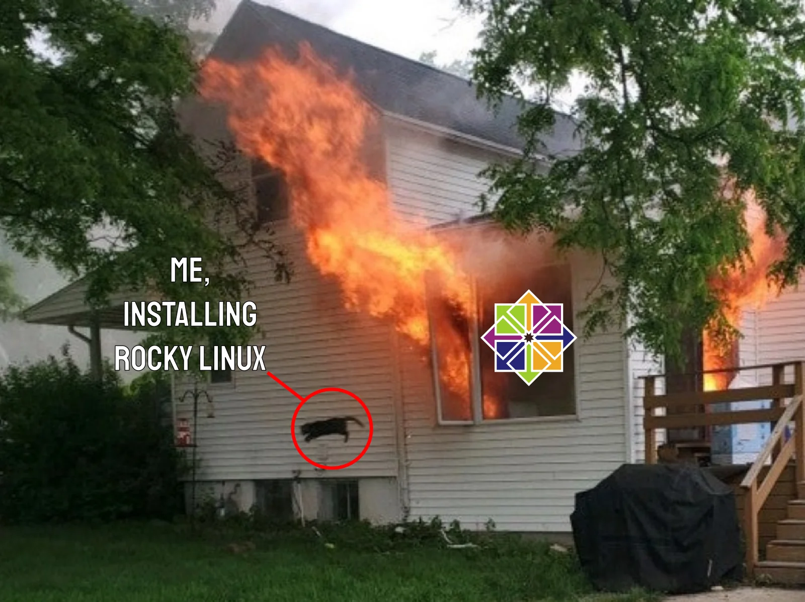

[](https://www.reddit.com/r/linuxmasterrace/comments/rslqxo/centos_linux_8_end_of_life_december_31st_2021/)

기술지원 종료된 CentOS 가상화 서버를 Rocky Linux 9 가상화 서버로 이관한 과정을 정리해본 글.


## 주요 절차

Rocky Linux 9 서버로 이관 작업 시에 거쳤던 절차는 아래와 같음.

1. 가상화 서버 생성
2. Rocky Linux 9 설치 및 기본 설정
3. 데이터 최초 이관
4. 애플리케이션(WEB, WAS, DB 등) 기동 테스트
5. 데이터 최종 이관
6. 실제 서비스 IP로 변경

데이터를 최초, 최종으로 두 번 나누어 이관한 이유는 애플리케이션 기동 테스트를 해보기 위함임. 최초 데이터 이관 후 애플리케이션 기동 테스트 성공하면 최종 이관하면 되는 것이고, 실패하면 뭐... 이관 못 하는 거임 😭


## 1. 가상화 서버 생성

구 서버의 CPU 코어 수, 메모리 및 디스크 용량 등을 동등 이상으로 설정하여 신 서버 생성.


## 2. Rocky Linux 9 설치 및 기본 설정

설치는 매우 쉬우니 설명 생략...

### 유저 생성

`useradd -d /home/<USER_NAME> -m <USER_NAME> -s /bin/bash` 명령어로 기존 서버에 생성돼있는 유저 동일하게 생성.

구 서버에 어떤 유저가 생성되어 있는지 모르겠다면, 기존 서버의 `/etc/passwd` 파일을 열어서 UID 값이 1000 이상이면 유저 확인. UID 값이 1000 이상이면 대체로 `useradd` 명령어로 생성된 유저임.

### 임시 IP 부여

`nmtui` 명령어로 임시 IP 부여. 구 서버에서 신 서버로 데이터를 이관하거나 테스트하기 위함임.

### 네트워크 설정

신 서버의 OS 방화벽 설정이 필요한 경우 `firewall-cmd` 명령어로 알아서 적절히 설정.

신 서버가 폐쇄망에 연결되어 있고 dnf 명령어로 패키지 설치가 필요한 경우 방화벽이나 IPS 장비 등에서 80, 443번 포트 통신을 허용해줘야 함. 80, 443 포트로 어느 곳에서든 접속 허용해주는 게 부담스럽다면 `/etc/yum.repos.d` 경로 파일에 명시된 URL(예: https://mirrors.rockylinux.org)의 IP 통신만 허용 해주면 될 듯?

신 서버가 웹방화벽이나 망연계장비의 영향을 받는지도 확인.

### 호스트네임 설정

`/etc/hostname` 파일을 열어서 호스트네임 적고 저장한 후 재기동하면 반영됨.

호스트네임이 잘 바꼈는지 못 믿겠으면 `hostname` 명령어 실행해보면 됨.

### NTP 설정

시간 동기화를 위해 NTP 설정.

1. `sudo dnf instal chrony` 명령어로 chrony 설치
2. `sudo systemctl enable chronyd --now` 명령어로 chrony 서비스 활성화. 잘 활성화 됐는지 못 믿겠으면 `sudo systemctl status chronyd` 명령어로 확인.
3. `/etc/chrony.conf` 파일을 열어 아래처럼 NTP 서버 추가

```shell
server time.bora.net iburst
server 기타_NTP_서버_주소 iburst
```

4. `sudo systemctl restart chronyd` 명령어로 chrony 서비스 재시작
5. `chronyc sources -v` 명령어로 NTP 서버 동기화 상태 확인. NTP 서버 주소 앞에 `^*`라고 나타나면 정상임.
   * NTP가 잘 작동하지 않는다면 123 UDP 포트 접속 허용 설정 필요
   * `chronyc tracking` 명령어로 세부사항을 볼 수 있음

### ulimit open files 값 설정

Rocky Linux 9 버전에서 하나의 프로세스가 열 수 있는 최대 파일 개수는 기본적으로 1024임.

`/etc/security/limits.conf` 파일에 아래 내용을 추가하여 확장함.

```shell
*    soft    nofile    65535
*    soft    nproc     65535
*    hard    nofile    65535
*    hard    nproc     65535
```

### 파일시스템 생성 및 마운트

디스크가 여러 개 들어가있거나 파티션이 여러 개 나눠져 있는 경우 기존 서버와 동일하게 볼륨그룹, 논리볼륨, 파일시스템 등 설정.

Rocky Linux 9 설치 과정 중에 설정해도 되고, 설치 완료된 후에 설정하려는 경우 [Rocky Linux 9 파일시스템 설정 글](https://jeonwon.dev/system/linux/rockylinux9-filesystem-setting/) 참고.


## 3. 데이터 최초 이관

**기본적으로 이관한 데이터는...**

* `/root` 및 `/home` 경로의 유저별 디렉터리에 저장된 `.bash_profile` 파일
* `/etc/profile` 파일 내용 일부
* JAVA를 사용하는 경우 JAVA가 설치된 경로(보통 `.bash_profile` 파일 또는 `/etc/profile` 파일에 JAVA_HOME 경로가 명시되어 있음)
* WEB, WAS, DB 또는 기타 애플리케이션 등이 사용하는 경로
* cron에 등록된 명령어(root 또는 각 유저별로 로그인 후 `crontab -e` 명령어로 확인)

**데이터 이관은 rsync 명령어로 하는 것이 좋음.** 왜냐하면...

* 파일(디렉터리) 소유자와 권한을 그대로 유지한 채로 이관할 수 있음
* 증분 데이터를 이관하므로 최종 이관작업 시 작업시간을 줄일 수 있음

```shell
# -a: 권한유지, -v: 자세한 정보 출력, -z: 압축전송 , -h: 휴먼이 알아보기 쉽게
# --delete: 구 서버에 삭제된 데이터가 있으면 신 서버에서도 삭제함
# --bwlimit: 최대 전송속도 설정. 단위는 KB/s. (네트워크 대역폭 이슈가 생길 것 같거나, EMS에서 네트워크 사용량 경고 날리는 게 싫으면 쓰면 될 듯)
$ rsync -avzh --delete <OLD_SERVER_PATH> --log-file=<LOG_FILE_PATH> --bwlimit=10240 <NEW_SERVER_OS_ID>@<NEW_SERVER_IP>:<NEW_SERVER_PATH>
```

```shell
# 예: rsync를 사용하여 구 서버 /home/rocky 경로를 신 서버의 동일한 경로에 이관하는 명령어
$ rsync -avzh --delete /home/rocky root@<NEW_SERVER_IP>:/home
```


## 4. 애플리케이션 기동 테스트

아마도 제일 오래 걸릴 단계. 어떤 오류가 나올지 모르기 때문. 로그 보면서 오류를 하나하나 잡아가야 함.

이 단계 실패하면 이관 못 하는 거임... 😭

작업하면서 겪었던 오류들과 해결법은 다음과 같음.

### rsync 연결 시 no hostkey alg 오류 발생

CentOS 6 서버에서 Rocky Linux 9 서버로 rsync 연결 시 no hostkey alg 오류가 발생함.

Rocky Linux 9 서버에서 `update-crypto-policies --set LEGACY` 명령어 실행 후 재부팅하면 해결됨.

다시 원복하려면 `update-crypto-policies --set DEFAULT` 명령어 실행 후 재부팅.

### OpenJDK 1.7 라이브러리 의존성 오류 발생

Rocky Linux 9 서버에서 OpenJDK 1.7 버전을 사용하는 JAVA 애플리케이션 실행 시 libgconf 라이브러리 의존성 오류가 발생하여 구 서버에 있던 `/usr/lib64/libgconf-2.so.4.1.5` 파일을 신 서버에 복사한 후 심볼릭 링크를 만들어 해결함.

```shell
$ ln -s /usr/lib64/libgconf-2.so.4.1.5 /usr/lib64/libgconf-2.so.4  # 심볼릭 링크 생성
$ ls -alrt libgconf-2.so.4.1.5   # 생성 확인
$ chmod 755 libgconf-2.so.4.1.5  # 권한 설정
```

### WEB, WAS에 별다른 오류 로그가 없음에도 404 Not Found 에러 발생

알고보니 신 서버로 이관 안 된 데이터가 있었음...


## 5. 데이터 최종 이관

구 서버와 신 서버의 애플리케이션(WEB, WAS, DB 등)을 종료한 후 rsync를 사용하여 최종 데이터 이관.


## 6. 실제 서비스 IP로 변경

구 서버의 IP를 신 서버에 그대로 사용하는 경우... `ifdown` 등의 명령어를 사용하여 구 서버의 네트워크를 종료한 후 신 서버의 IP를 구 서버의 IP로 변경.

이제 신 서버의 애플리케이션(WEB, WAS, DB 등) 기동하고 정상작동 여부 테스트 해주면 끝임. 😄