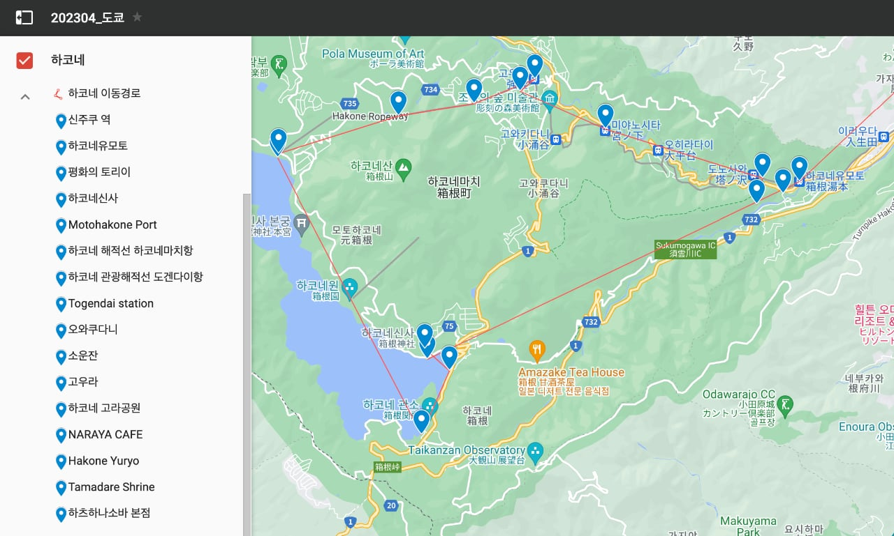

도쿄 주변 소도시 여행지 중 한 곳으로 하코네를 갔습니다. 쿠로타마고(검은 달걀)를 까먹으며 후지산을 보고, 하코네 로프웨이와 등산철도를 타며 하코네마치를 돌아볼 계획이었는데 날씨가 좋지 않아 대부분 못하고 돌아왔습니다. 😭

그럴싸한 하코네 여행 계획은 아래와 같이 있었습니다. 날씨에 쳐 맞기 전까진... 🥶

1. 하코네 여행 하루 전, 신주쿠 역내 오다큐 외국인 여행센터에서 로망스카 승차권과 하코네 교통패스 구입
2. 신주쿠 역에서 로망스카를 타고 하코네유모토 역으로 출발
3. 모토하코네에서 하코네 신사와 평화의 토리이를 본 후 관광해적선 탑승
4. 하코네 로프웨이를 타고 쿠로타마고도 먹고 가능하면 후지산 전경도 보고...
5. 등산철도를 타고 하코네유모토로 복귀

## 🎫 하코네 프리패스 구매

하코네에 가기 하루 전날에 오다큐 외국인여행센터에서 로망스카 승차권과 하코네 교통패스를 구입합니다. 인터넷에 오다큐 외국인여행센터 운영시간이 8시 ~ 18시로 나와있었고, 다음날 아침 일찍 출발할 예정이어서 하루 전날에 미리 구입해놨습니다. (그런데 제가 간 날엔 운영시간이 7시 30분 ~ 20시였습니다.)

오다큐 외국인여행센터는 신주쿠 역 서쪽 부근 지하에 있습니다. 신주쿠 역이 워낙 복잡해서 길을 찾는 게 쉽지 않지만, 신주쿠 역 지하로 내려가서 오다큐 선을 타는 방향으로 가다보면 Odakyu Sightseeing Service Center라는 곳을 찾을 수 있습니다.

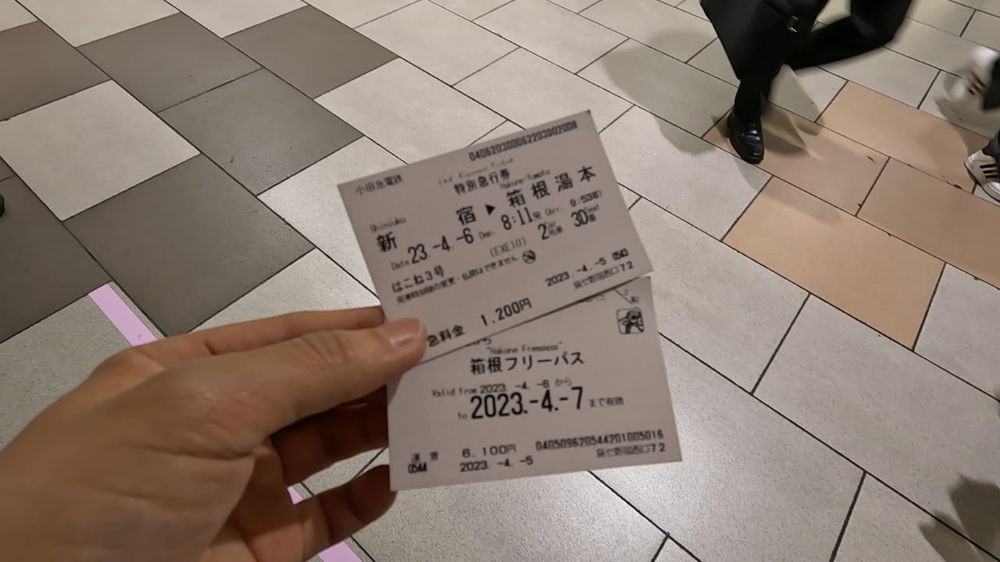

## 🚆 로망스카 타고 가즈아

로망스카는 신주쿠 역에서 하코네유모토 역까지 이동하는 열차입니다. 하코네유모토 역까지 도착하는데 약 1시간 40분이 걸렸습니다.

평소에 아침밥을 먹진 않지만, 왠지 아침 일찍 기차를 타면 뭔가 먹어줘야 할 것 같습니다(?)

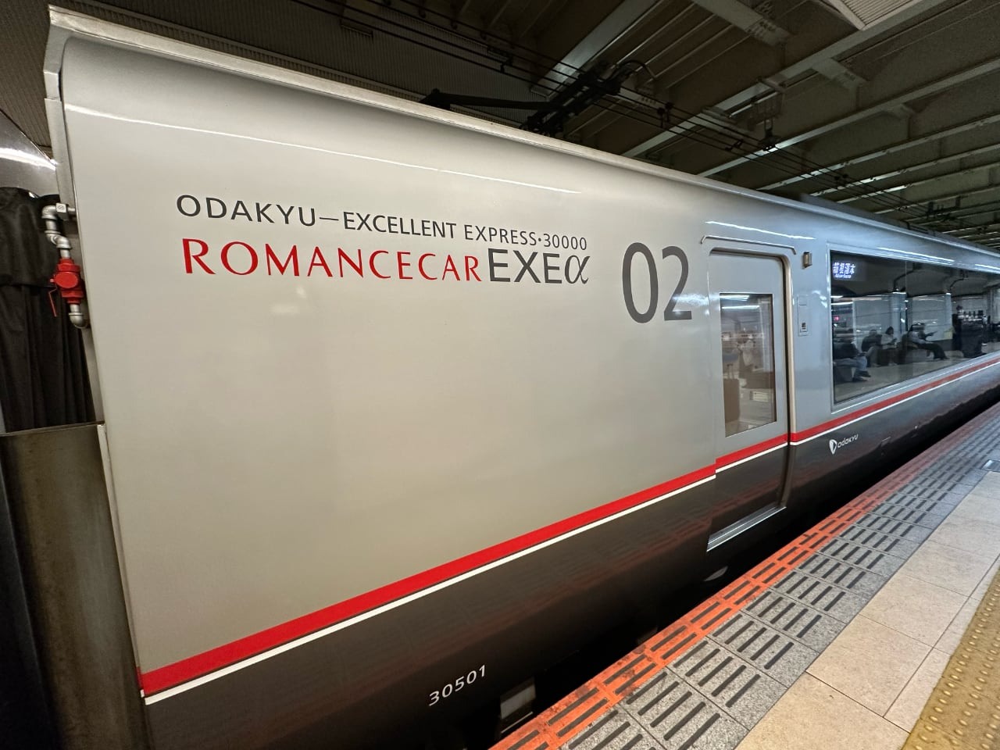

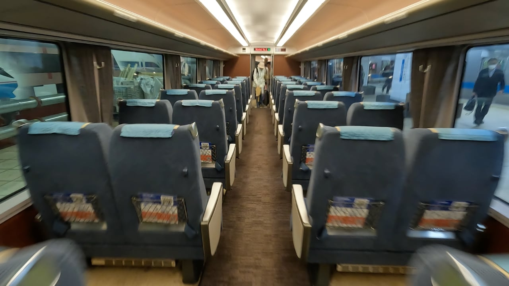

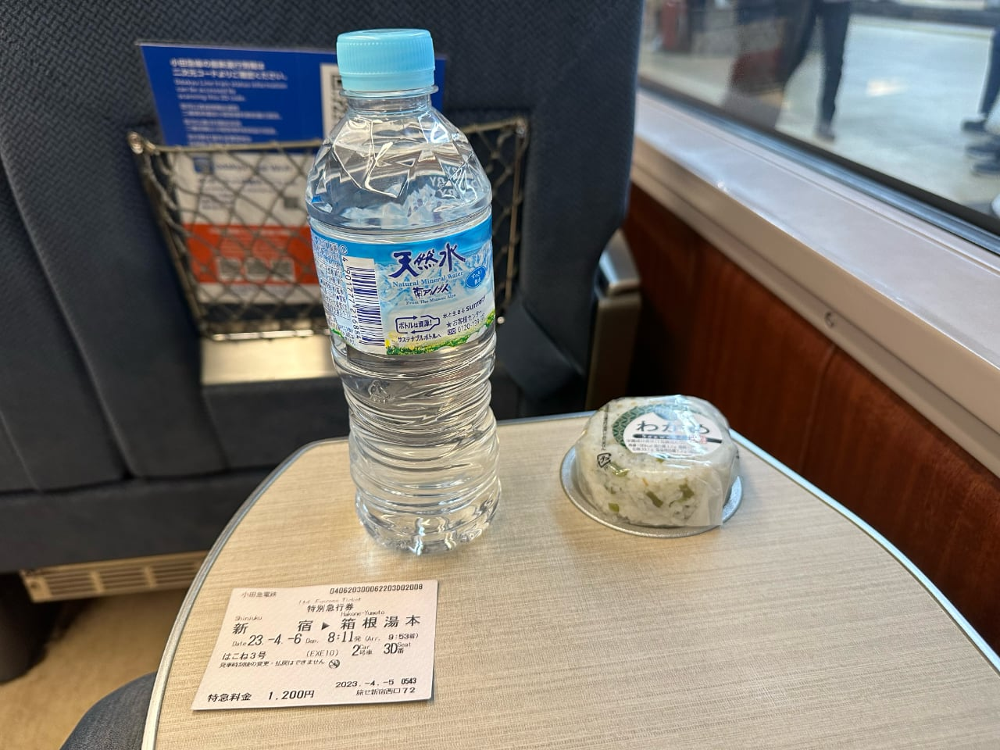

가다보니 점점 푸른 하늘이 보이기 시작합니다. 행복회로 돌려도 되는 각...?

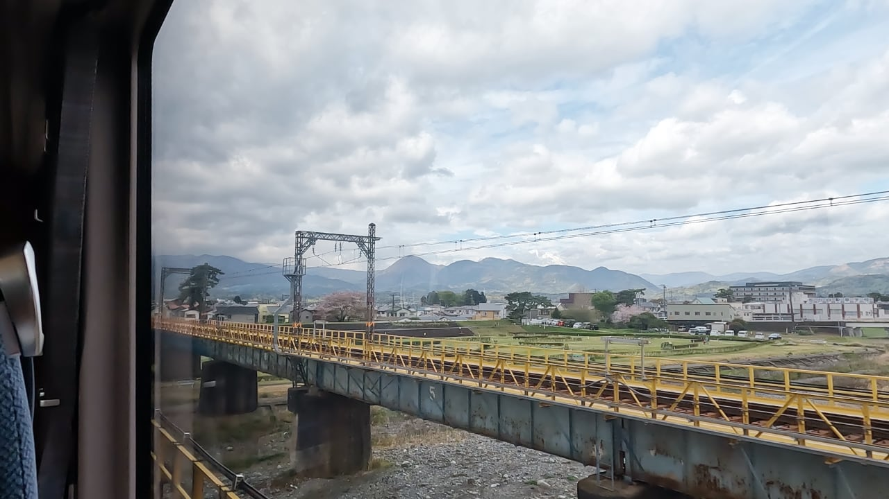

## 🚉 하코네유모토 역 도착

하코네유모토 역에 도착 후 역무원에게 로망스카 마지막 열차 시간을 물었습니다.

> 新宿行きのロマンスカーの最終時間はいつですか？ (신주쿠이키노 로만스카아노 사이슈우지칸와 이츠데스카)
>
> 신주쿠 행 로망스카 마지막 시간이 언제인가요?

그러자 역무원이 말합니다.

> あ... Final time?

... 아무래도 외국인인 게 티가 나는 모양입니다. 처음부터 영어로 물어볼 걸... 아무튼 마지막 로망스카는 오후 7시 30분쯤에 있었습니다. 이 때까지 하코네마치를 한 바퀴 돌고 올 계획입니다.

하코네유모토 역 입구 방향으로 쭉 직진하면 나오는 2번 버스정류장에서 버스를 탑승한 후 모토하코네로 이동했습니다.

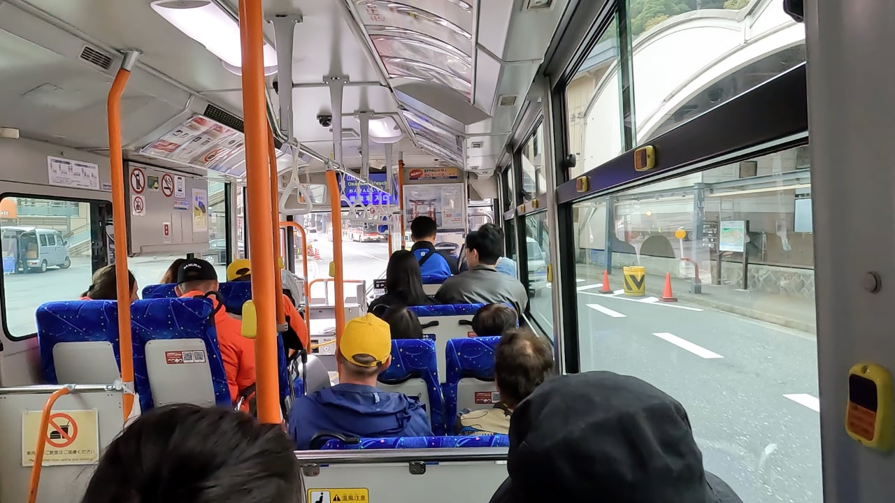

## 🌊 간지폭풍 모토하코네

버스를 타고 모토하코네로 이동하는 도중에 조금씩 비가 내리기 시작했습니다. 아이폰 날씨 앱에 오늘 비는 오지 않고 흐리다고만 되어 있어서 우산도 안 챙기고 하코네에 왔건만... 모토하코네로 가면 갈수록 점점 잣됐음을 느끼기 시작했습니다.

모코하코네에 도착하니 비가 오고 강풍이 불고, 야시노 호수는 범람하려 하고 안개는 엄청 끼어있었습니다. 아... 오늘 여행은 정말 잣됐구나... 하하하... 😂

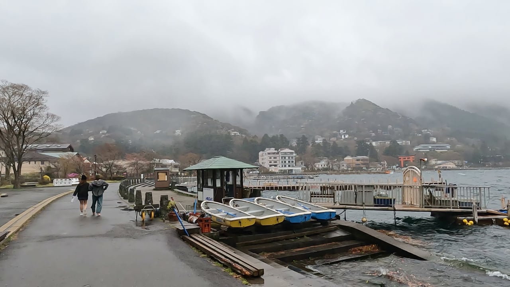

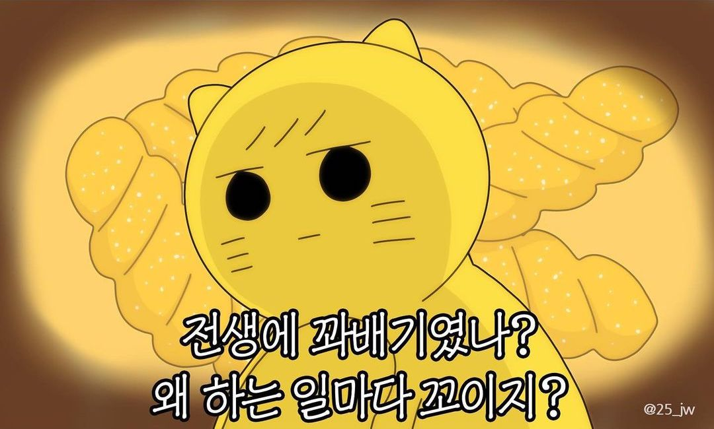

## ⛩️ 하코네 신사

하코네 신사는 평화의 토리이에 들르기 전에 잠시 들러본 곳입니다. 신사에 들러서 꼭 찾아보는 것이 바로 에마(소원 등을 적는 나무판)인데요. 사람들이 어떤 소원을 비는지 읽어보는 재미가 있습니다. 영어 자격증으로 보이는 시험과 학교 무사 졸업 및 합격 기원이 눈에 띄네요.

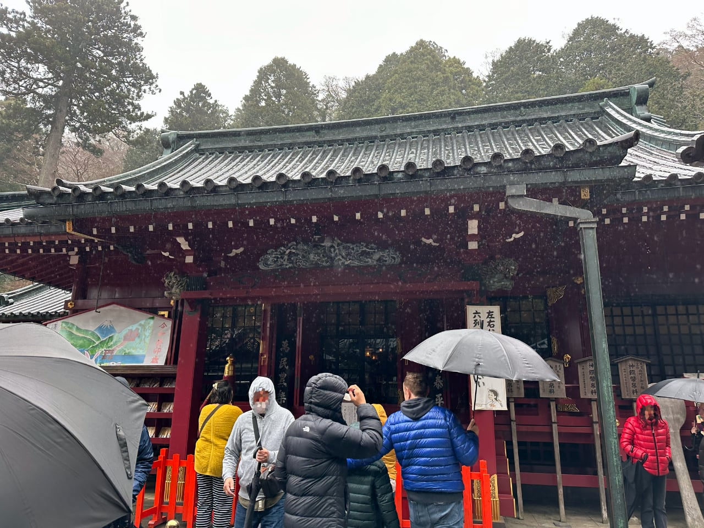

## ⛩️ 평화의 토리이

토리이는 신사의 입구에 세우는 기둥문입니다. 토리이는 신의 영역과 일반 세계의 경계를 이루는 관문 역할을 한다고 합니다. 하코네 신사에서 야시노 호수 방향으로 내려가면 특이하게 물 위에 떠있는 듯한 평화의 토리이가 있습니다. 이 평화의 토리이는 하코네 신사 입구의 일종이려나요...? 🤔

궂은 날씨에도 평화의 토리이 앞에서 사진을 찍으려는 행렬이 엄청났습니다. 날씨가 맑을 때 오리배를 타고 평화의 토리이를 금방 지나가지 못하고 근처에 남아있으면 왠지 눈치보일 것 같습니다.

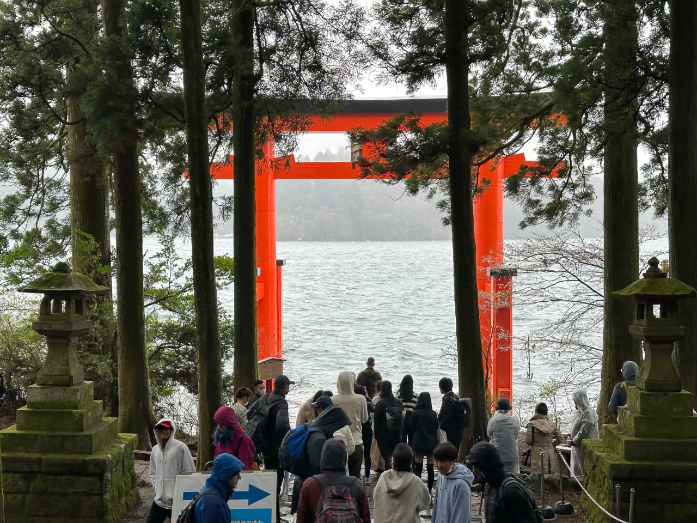

## ☠️ 점심 먹고 관광해적선 탑승

하코네로 여행오기 전에 관광해적선을 모토하코네 항에서 타는 줄 알았습니다. 그런데 모토하코네 항에선 일반 크루즈 선을 탈 수 있습니다. 알고보니 관광해적선은 모토하코네 항에서 남쪽으로 1.5km 떨어진 하코네마치 항에서 타야 합니다. 버스를 타고 가자니 버스 대기시간과 이동시간을 합치면 걸어가는 시간과 별 차이가 나지 않을 것 같아서 걸어서 하코네마치 항으로 이동했습니다.

관광해적선은 매 시간 정각에 출발합니다. 하필 5분 늦어서 다음 시간까지 기다려야 했는데, 이렇게 된 이상 근처에서 점심을 먹기로 했습니다. 하코네마치 항 입구 건너편에 음식을 파는 곳이 있었지만 대부분 문을 닫아서 이곳저곳 돌아보다가 [히레카츠를 파는 음식점](https://goo.gl/maps/TTF3Gr8JbNvrPXwY6)에 갔습니다.

고기와 튀김옷이 잘 분리되는 게 흠이었지만, 튀김옷이 마치 닭껍질튀김처럼 느껴져서 신박했습니다. 

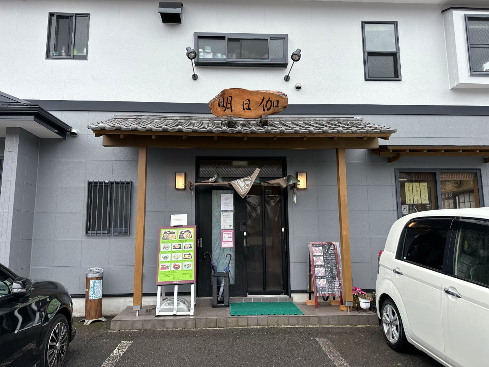

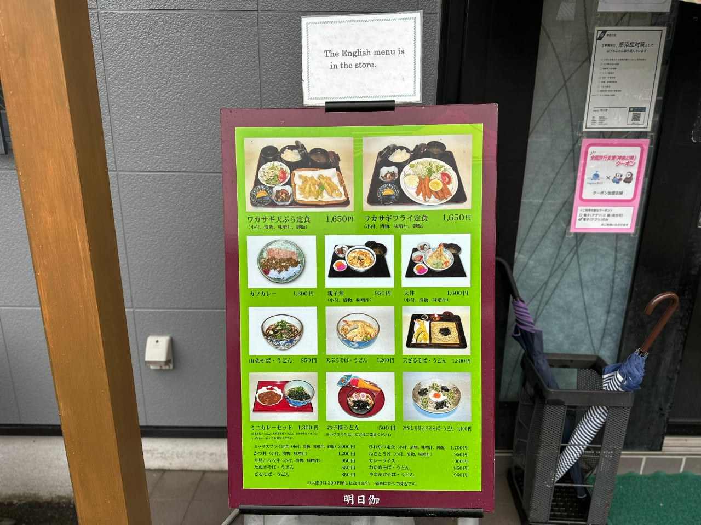

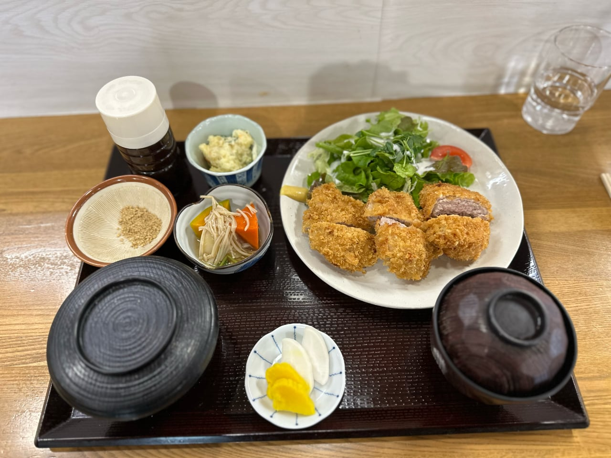

아무튼 맛있게 먹은 다음

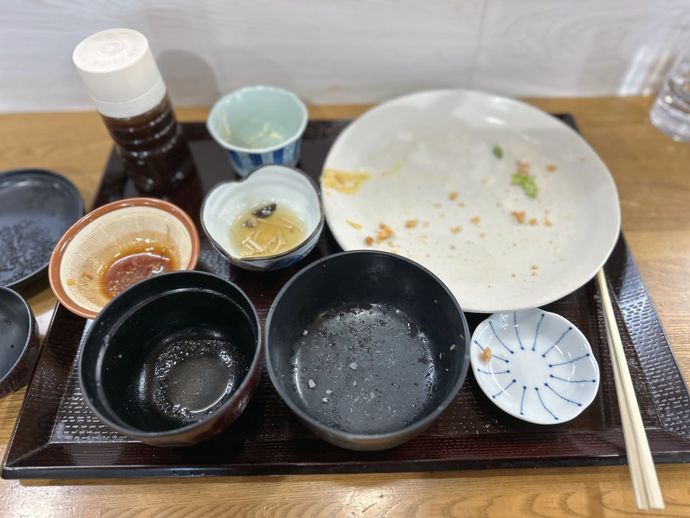

해적선을 타고 도겐다이 항으로 갑니다. 안개가 잔뜩 껴서 그런지 해적선 위에서 바라본 야시노 호수 풍경은 운치가 있는 듯하면서 별로였습니다... 🙄

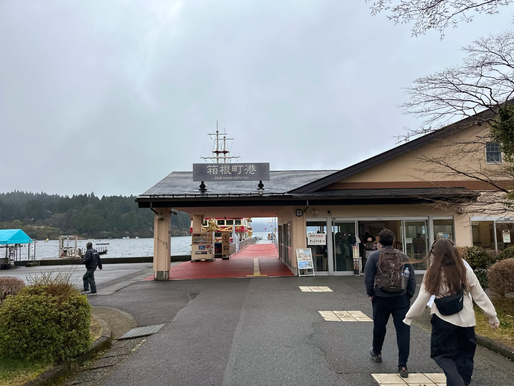

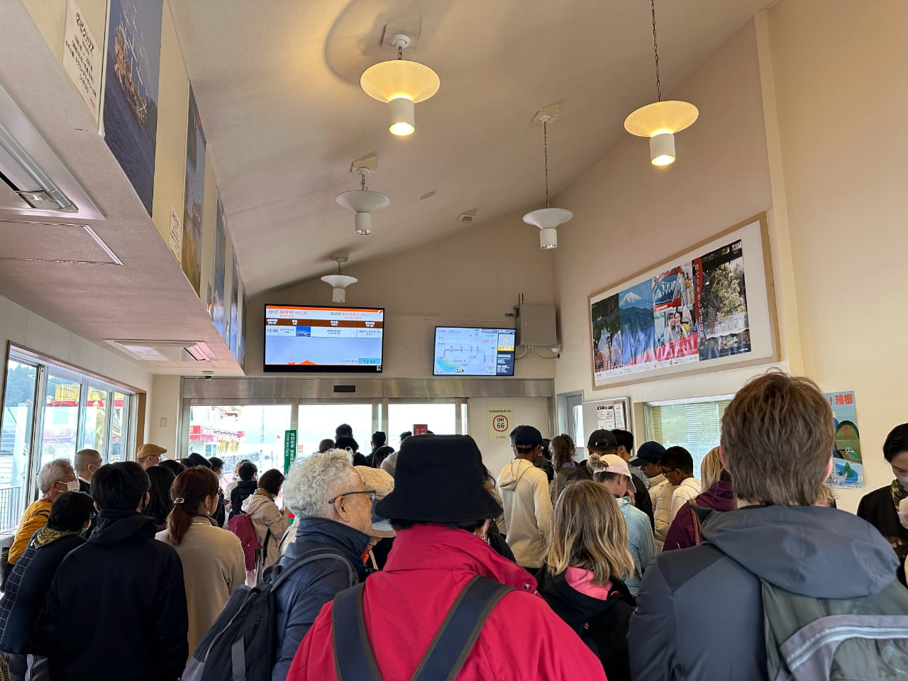

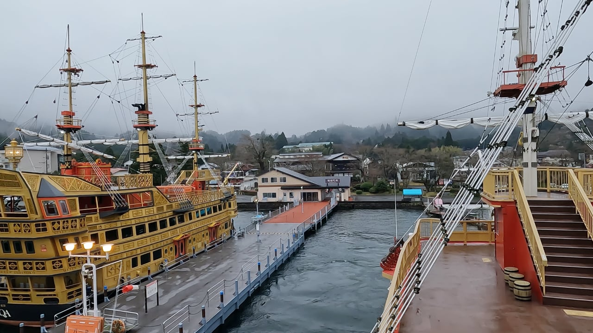

## 🚡 도겐다이 항에서 로프웨이는 달리고 싶다...

로프웨이 탈 생각에 싱글벙글할 예정(?) 이었지만...

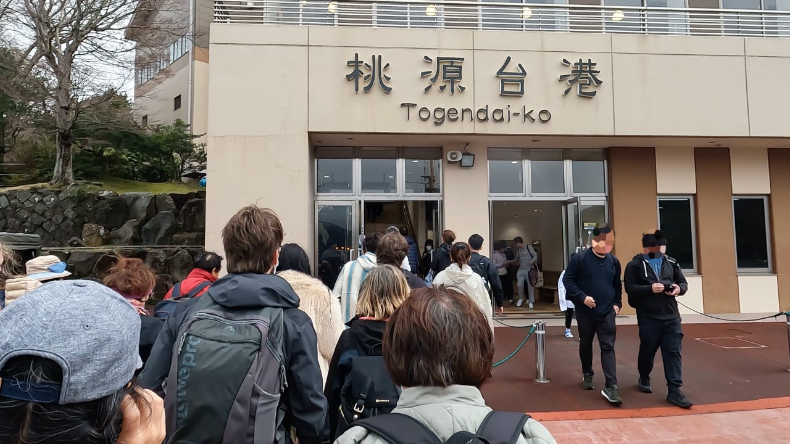

강풍 때문에 로프웨이 운행이 중단됐습니다. 애초에 기대를 하니까 실망을 하는 것인지... 😭

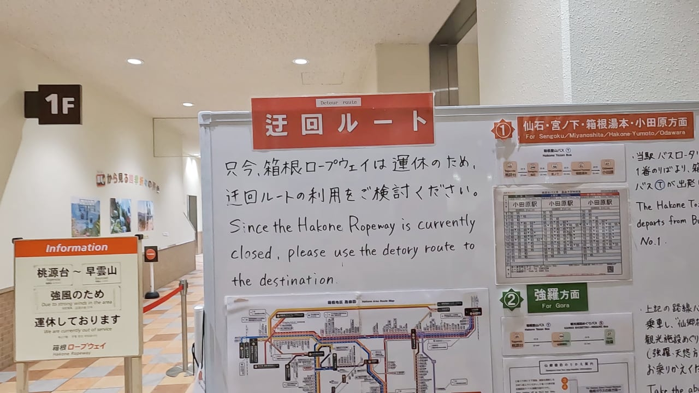

아니 오와쿠다니에 가서 유황이 분출하는 것도 봐야 하고 하코네마치를 한바퀴 돌려면 로프웨이를 타야 하는데 이를 어찌하나... 이미 하코네 여행은 날씨 때문에 망했으니 해적선을 타고 다시 하코네유모토로 돌아가야 하나 걸어서 오와쿠다니를 가야 하나 만감이 교차했습니다. (만약 이 때 정말 걸어서 오와쿠다니에 갔다면 무사하지 못했을 겁니다. 😨)

근처 안내원에게 오와쿠다니에 갈 수 있는 방법이 있는지 물어보니, 도겐다이 항 밖으로 조금만 나가면 있는 코지리 터미널에서 버스를 타면 된다고 합니다. 버스를 탈 때 하코네 교통패스를 사용할 수 있냐고 물어보니 안 된다고 합니다. 일단 스이카(선불 교통카드)로 버스에 탑승한 후 오와쿠다니로 이동했습니다.

그런데 오와쿠다니로 갈수록 안개가 심해집니다... 아 설마...? 😱

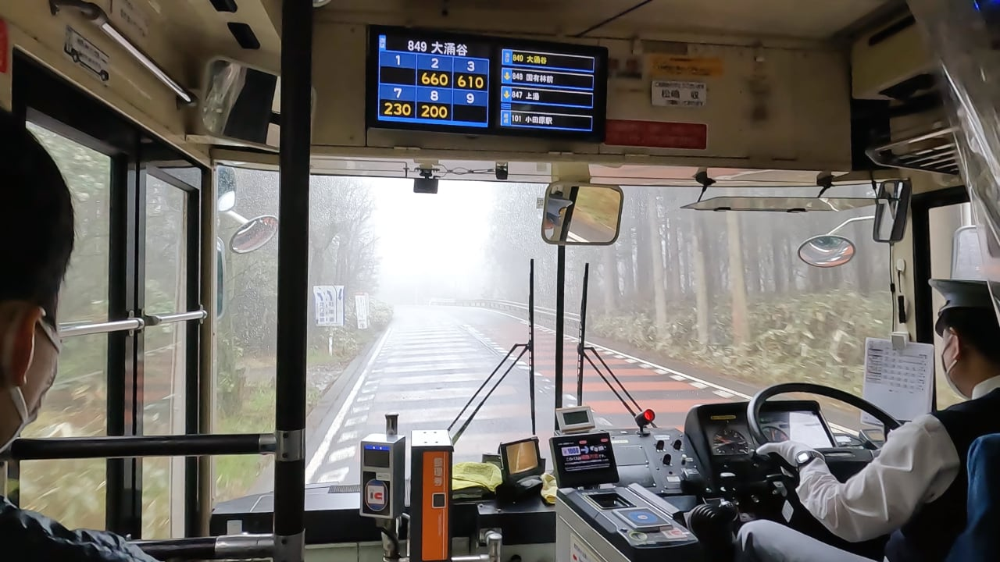

## 🥚 오와쿠다니

설마가 그 설마였습니다. 이렇게 가시거리가 짧은 경우는 처음이었고, 유황이 분출하는 모습은 전혀 볼 수 없었으며 유황 냄새가 좀 나긴 했지만 별로 나지 않는 수준이었습니다.

날씨가 좋으면 후지산을 보고, 날씨가 흐리면 유황이 분출하는 장면을 보며 쿠로타마고를 까먹으려 했었습니다. 아무리 날씨가 흐려도 유황은 볼 수 있겠지라고 생각했었지만 안개가 이렇게 심해서 아예 보이지 않을 줄은 몰랐습니다. 일단 쿠로타마고를 사긴 했지만 강풍이 너무 심해서 도저히 까먹을 수 없었습니다.

뭐 긍정적으로 생각하자면 근처 관광객들이 강풍에 반응하는 모습이 너무 재밌긴 했습니다. 🤣 하지만 이미 날씨 때문에 망해버린 기분을 어찌 하오리까... 😭

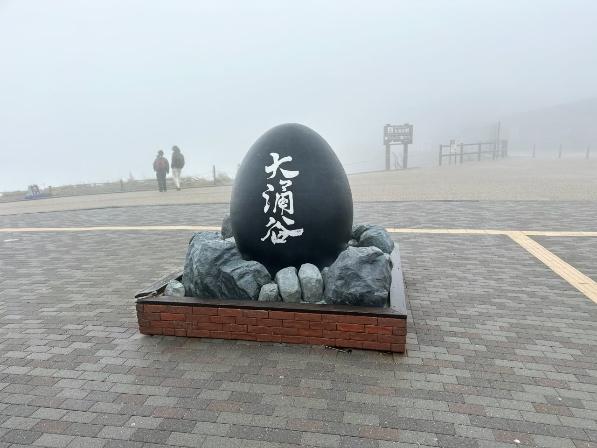

아쉬움을 뒤로 하고 다시 버스에 탄 후 소운잔으로 이동합니다.

## ⛰️ 소운잔

원래 소운잔엔 로프웨이를 타고 와야 했으나 어쩔 수 없이 버스를 타고 왔습니다. 이곳에선 족욕을 하며 주변 경치를 볼 수 있는데요. 하필 오른발 사마귀 치료를 받아 물집이 생기는 바람에 발을 담그고 오지는 못했습니다. ☹️

바람이 잠잠해진 틈을 타서 후딱 사이다를 사온 후 쿠로타마고를 까먹었습니다. 맛은... 그냥 삶은 계란 맛입니다. 하지만 이런 특이한 걸 먹어줘야 여행온 기분이 나는 것 같습니다.

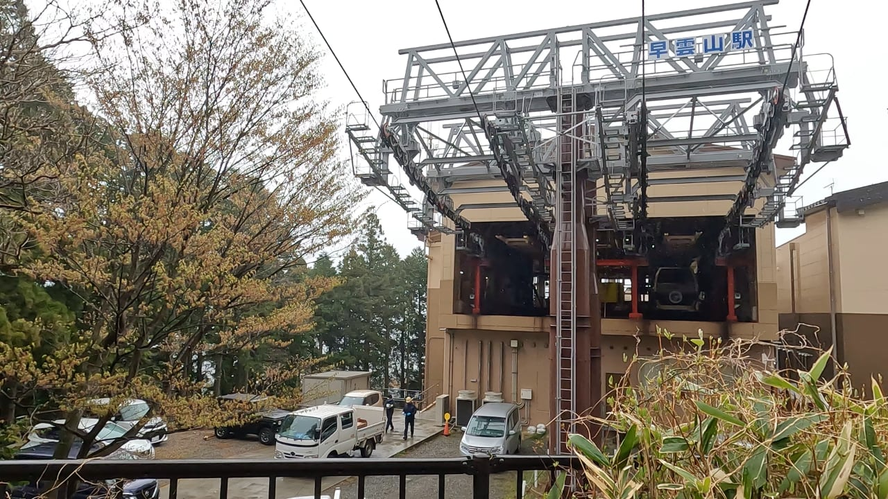

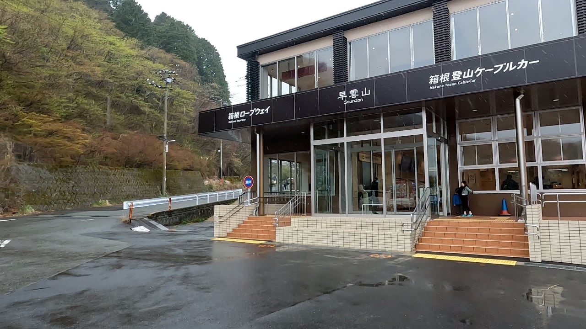

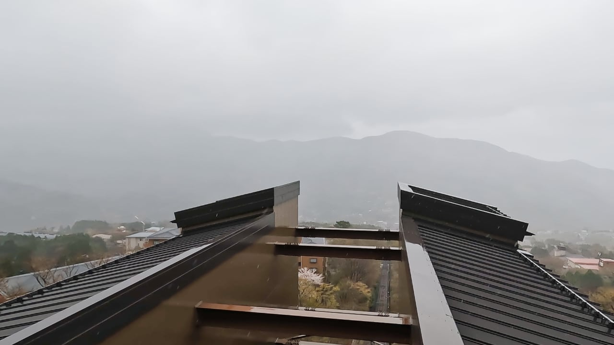

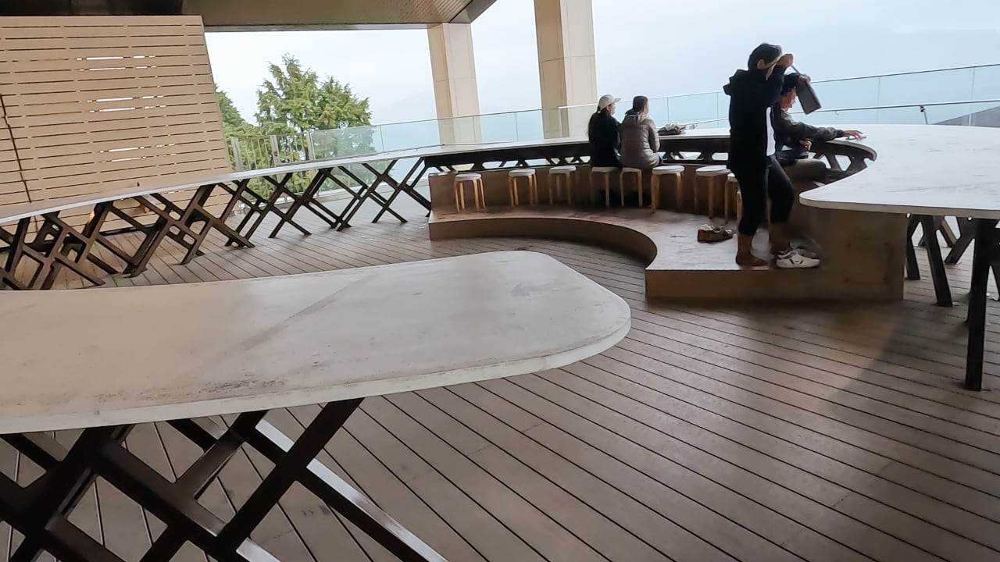

## 🚡 다행이 케이블카는 운행 중...

소운잔 역부터는 로프웨이가 아닌 케이블카를 타고 이동합니다. 설마 케이블카도 강풍 때문에 운행이 중단됐나 싶었지만 다행이 운행중이었습니다. 하코네 교통패스를 제시하고 무료로 탑승한 후 고라 역까지 이동했습니다.

## 🏞️ 고라 공원... 고라 파덕...

원래 하코네 여행 중에 온천에 가볼 계획을 세웠었습니다. 그런데 오른발에 난 사마귀 치료를 받느라 온천에 가볼 수 없게 됐습니다. 그래서 대신 가본 곳이 바로 고라 공원입니다.

고라 공원도 하코네 교통패스를 제시하면 무료로 입장할 수 있습니다. 잘 꾸며진 공원처럼 보였지만 역시나 그놈의 날씨 때문에... 고라 공원의 영문명(Gora Park)이 고라파덕(Gora Paduck)으로 읽히질 않나... 게다가 하코네(Hakone)가 학원(HakOne)으로 읽히질 않나... 점점 맛이 가기 시작했습니다. 🤪

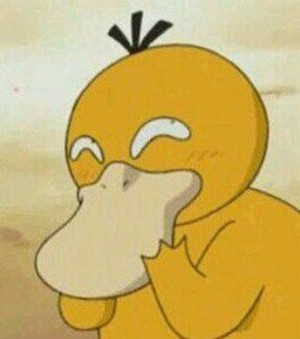

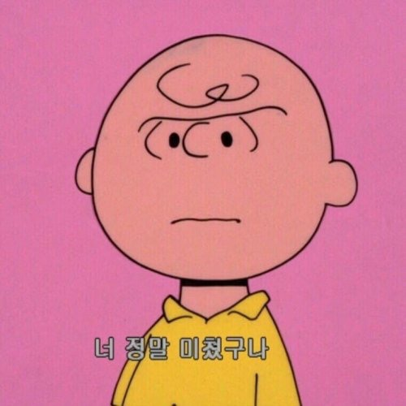

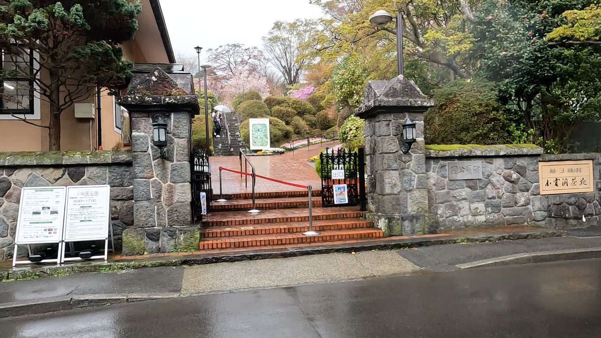

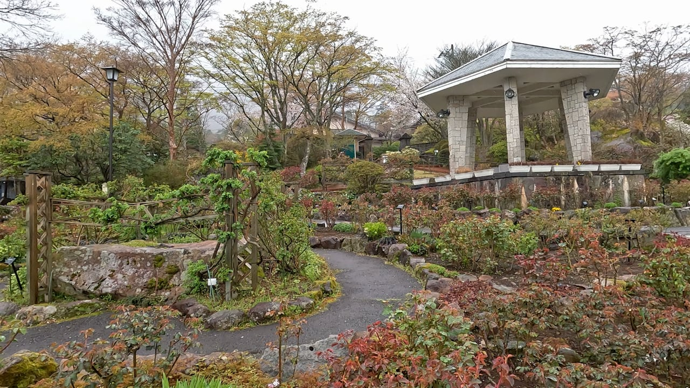

## 🚞 등산철도 탑승

혹시 등산철도도...? 다행이 등산철도도 운행 중이었습니다. 사실 등산철도마저 운행이 중단될 정도로 강풍이 불었다면 거의 재난급이 아닐까 싶습니다.

등산철도를 타고 하코네유모토를 향해 돌아갔습니다.

## ☕ 나라야 카페

하코네유모토로 돌아가기 전에 잠깐 미야노시타 역에서 내린 후 나라야 카페를 들렀습니다. 고독한 미식가에서 고로 상이 눈사람 모양의 모나카를 만들어 먹는 장면이 나오는데, 저도 한번 해보고 싶어서 가봤습니다.

주문한 커피(아메리카노)와 팥 앙금 모나카입니다. 직접 팥을 채워서 모양을 만든 후 먹으면 됩니다. 별 것 아닌 것처럼 보이는 화과자를 만들어 먹는데 궂은 날씨 때문에 받은 상처(?)가 치유되는 느낌이 듭니다. 🥲

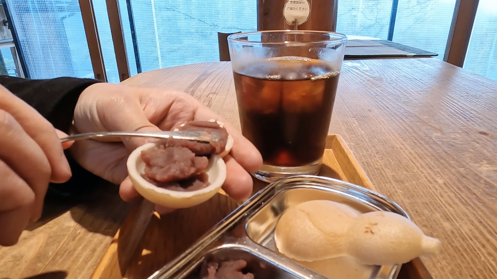

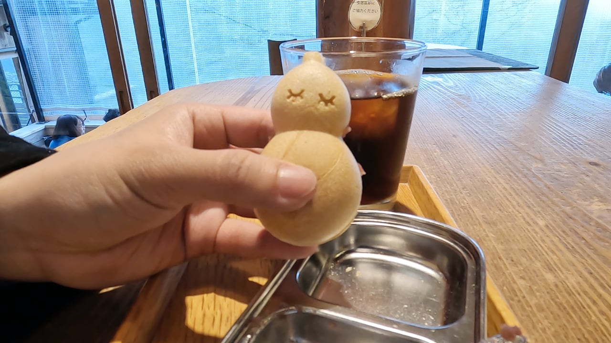

카페인데 특이하게 족욕탕이 있습니다. 맛있게 냠냠 먹은 후 소운잔에서 담그지 않았던 발을 결국 족욕탕에 담가봤습니다. 물론 아쉽게도 왼발만...

## 🍜 하츠하나소바

하코네유모토역에 도착해보니 로망스카 마지막 탑승시간까지 여유가 있어서 하츠하나소바 라는 가게에서 소바를 먹었습니다.

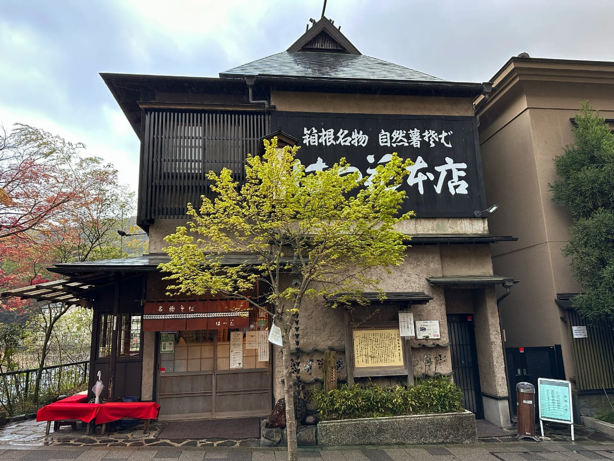

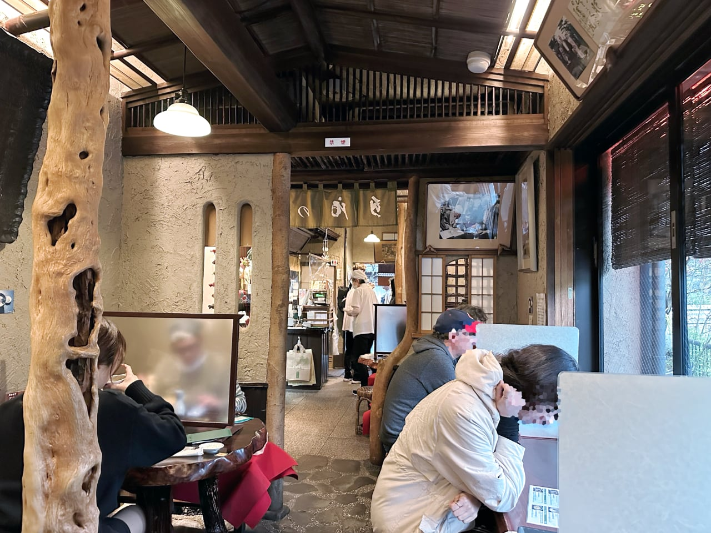

주문한 메뉴는 텐자루입니다. 맛있게 먹고나니, 일본에서 먹었던 면 요리 중에 사누키 우동이 생각납니다. 예전에 다카마쓰를 짤막하게 여행했을 때 아무 우동집이나 가도 너무 맛있었던 기억이 생생한데, 나중에 돈 많이 벌어서(?) 다카마쓰로 우동 투어를 가보고 싶습니다. 😎

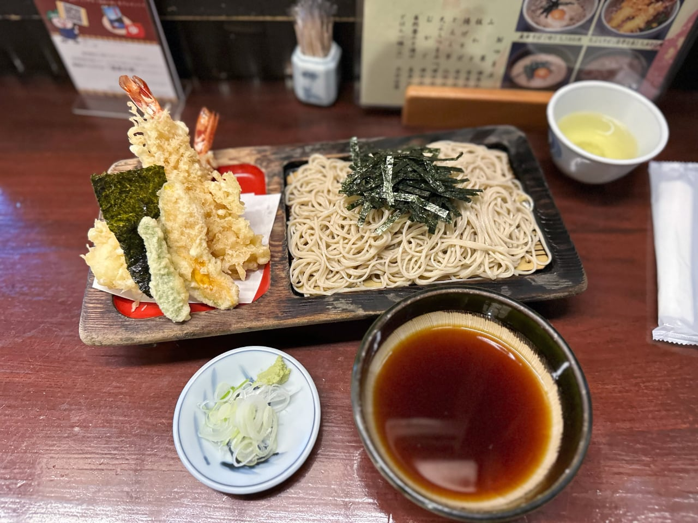

맛있게 먹고 하코네유모토 역으로 향하니...

날씨가 개기 시작합니다. 참 야속하기만 합니다. 킹받았던 날씨 함께헤서 더러웠고 제발 다시는 만나지 말자... 

(고 다짐했건만 다음날 요코하마에서 또 만날 예정(?)입니다. 😱)

다음 번엔 요코하마 여행기를...

※ 이 글에서 사용한 짤의 출처는 [25일 작가님의 인스타그램](https://www.instagram.com/25_jw)입니다.