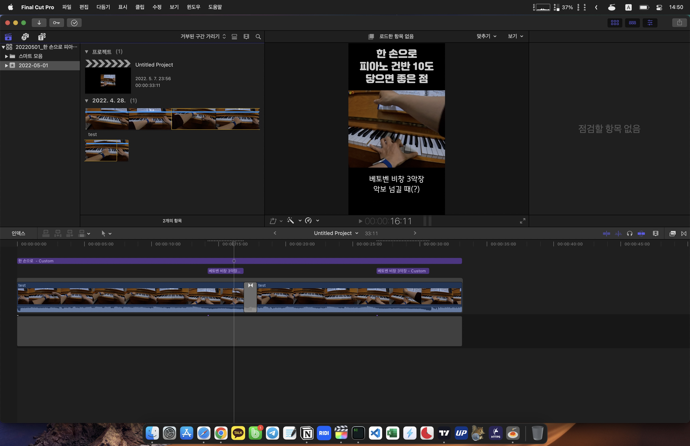

[파이널 컷 한시간에 끝내기](https://youtu.be/2aORJ7hKVMI) 유튜브 동영상 보고 파이널 컷 프로(Final Cut Pro) 사용법을 정리한 글.


## 🤔 파이널 컷 프로를 쓰는 이유
* 가장 큰 이유는 맥북이 있어서...
* 어도비 프리미어 프로는 구독료를 내고 써야 하는데, 1년 넘게 쓸수록 파이널 컷 프로를 쓰는게 더 이득.

## 📁 파일시스템 구조

- 확장자가 `.fcpbundle` 인 파일로 모든 것이 관리됨. 변경 사항은 `.fcpbundle` 파일에 자동 저장됨.
- `.fcpbundle` 파일 안에 편집할 미디어(동영상, 이미지 등)를 보관할 수 있는데, 가장 권장하는 방법임.
- `.fcpbundle` 파일 내부는 `라이브러리 → 이벤트 → 폴더 → (스마트/키워드)컬렉션 → 프로젝트`로 구성되어 있음


## 🗃️ 컬렉션

### 스마트 컬렉션

라이브러리 생성 시 자동으로 생성되는 컬렉션

### 키워드 컬렉션

- 미디어들을 분류할 때 사용(태그라고 생각하면 될듯)
- 사용방법: 좌측 이벤트 목록을 마우스 우클릭 → 새로운 키워드 모음(New Keyword Collection) 클릭 → 키워드 지정할 동영상을 키워드 컬렉션으로 드래그 앤 드롭
- 한 동영상에 여러 개의 키워드 컬렉션을 설정할 수 있음


## 😨 용량이 너무 커질 때

편집을 거듭할수록 `.fcpbundle` 파일 용량이 기가 단위로 커짐. 설정(CMD+,)에서 다음과 같이 설정

- 재생 탭에서 `배경 렌더링(Background render)` 및 `멀티캠 클립에 최적화된 미디어 생성(Create optimized media for Multicam clips)` 체크 해제
- 가져오기 탭에서 `최적화된 미디어 생성 및 프록시 미디어 생성` 체크 해제(단, 이 기능은 사양이 낮은 MacOS 기기에서 필요할 수 있음)


## 🗓️ 프로젝트 생성

- 생성된 프로젝트가 없다면 화면 하단에 프로젝트 생성 버튼을 클릭하여 생성
- 생성할 프로젝트의 해상도, 프레임 등을 모른다면 가져온 미디어(동영상)을 마우스 우클릭 → 새로운 프로젝트(New Project) 클릭 → 자동으로 해상도, 프레임 등이 설정됨


## ✂️ 주요 단축키

### 편집

- `I`(in-point), `O`(out-point): 이벤트 내의 미디어를 프로젝트로 가져오기 전에 필요한 부분만 자르기 위해 사용
- `A`: 클립 선택 모드
- `B`(Blade): 클립 자르기 모드(CMD + B 단축키로 대체 사용 가능)
- `P`(Position): 마그네틱 타임라인 비활성화하여 클립을 드래그할 때 사용
- `R`(Range): 범위 선택 모드

### 타임라인

- `Q`: 선택한 미디어를 타임라인 뒤에 붙여넣기
- `W`: 선택한 미디어를 Time Indicator 기준으로 비집고 넣기
- `E`: 선택한 미디어를 Main Storyline 맨 뒤에 클립 넣기
- `V`: 클립 비활성화
- `Delete`: 타임라인 내 클립과 공간을 모두 삭제
- `Shift + Delete`: 클립은 삭제하되 공간은 유지
- `CMD + +`: 타임라인 확대
- `CMD + -`: 타임라인 축소
- `OPTION + [`: 타임라인 앞쪽 클립 삭제
- `OPTION + ]`: 타임라인 뒤쪽 클립 삭제
- `SHIFT + /`: 편집포인트 주변 미리보기

### 클립 양 끝 다듬기

클립의 양끝을 마우스로 클립의 처음 또는 끝 부분을 클릭한 후

- `,`: 왼쪽으로 1프레임 자르기
- `.`: 오른쪽으로 1프레임 자르기
- `SHIFT + ,`: 왼쪽으로 10프레임 자르기
- `SHIFT + .`: 오른쪽으로 10프레임 자르기

위 단축키는 클립 전체를 선택했을 때 사용하면 슬라이드됨

### 서로 인접한 클립 다듬기

- 두 클립의 인접한 부분을 다듬기(Trim) 도구(단축키 `T`)로 선택한 상태에서 양옆으로 움직이면 두 클립의 길이를 조절할 수 있음
- 세 클립이 연달아 있는 경우, OPTION키를 누른 상태에서 다듬기 도구로 중간에 있는 클립을 마우스로 드래그하면 양 끝에 위치한 클립의 길이를 조절할 수 있음

### 속도 조절

- `CMD + R`을 누르면 속도 조절 바가 나타남
- 값을 직접 입력하거나, 바 양 끝을 늘이거나 줄여서 조절할 수 있음

### 동영상 가져오기

- `SHIFT + 1`: 비디오와 오디오 모두 타임라인으로 가져오기
- `SHIFT + 2`: 비디오만 타임라인으로 가져오기
- `SHIFT + 3`: 오디오만 타임라인으로 가져오기

### 음량 조절

- `CONTROL + -`: 1db씩 음량 감소
- `CONTROL + +`: 1db씩 음량 증가

### 자막

- `CONTROL + T`: 자막 삽입

### 기타

- `COMMAND + 9`: 백그라운드 작업 표시
- `CONTROL + SHIFT + V`: 효과 붙여넣기


## 🎦 비디오 편집

### 꼭지

프로젝트 내 동영상에 자막을 추가하면 서로의 틈새에 꼭지 같은 세로 바가 보임. 이 동영상을 다른 타임라인으로 옮기면 자막도 같이 이동됨.

### 자막 삽입

- 자세한 설정은 자막을 선택한 후 우측 상단 인스펙터 탭에서 설정
- 프리셋 저장: 포맷(모양) 속성 저장[Save Font(Appearance) Attributes]

### 변형(Transform), 자르기(Crop), 왜곡(Distort)

- 화면 중간쯤 위 세 가지를 선택할 수 있는 아이콘이 있음. 이 아이콘을 클릭하여 마우스로 클립 조절
- 세부적으로 설정하려는 경우, 클립을 선택한 후 우측 상단 인스펙터 탭을 사용

### 애니메이션

- 애니메이션이 시작될 지점에 타임라인을 둔 후 클립의 키프레임을 추가
- 에니메이션이 종료될 지점에 타임라인을 둔 후(맨 뒤 프레임으로 이동한 후) 변형, 자르기, 왜곡 값 설정

### 클립 복사

`COMMAND + C, V` 사용해도 되지만 OPTION 키를 누른 채로 드래그해도 복사됨

### 거꾸로 재생

프로젝트 내 동영상 선택 → 화면 중간 쯤 시계 아이콘 클릭 → 클립 반전(Reverse Clip)


## 🔉 오디오 편집

### 음파 표시 변경

- 소리를 들으며 컷 편집을 해야 하는 경우, 음파 표시를 크게 설정하면 좀 더 편함.
- 프로젝트 내 동영상을 선택한 후 화면 오른쪽에 있는 클립 모양 변경(Select a clip display option) 아이콘을 클릭하여 음파 표시를 크게 설정

### 오디오 삭제 또는 병합

- 타임라인 내 클립을 마우스 우클릭 → 오디오 구성요소 확장(Expand Audio Components) → 비디오와 오디오가 분리되면 오디오 삭제(단축키는 `CONTROL + OPTION + S`)

### 오디오 설정

- 자세한 설정은 오디오를 선택한 후 우측 상단 인스펙터 탭에서 설정
- 오디오를 선택하면 나타나는 동그란 모양의 Audio Fade In, Out 표시를 드래그하여 설정

### 오디오 일부 구간 볼륨 줄이기

- 범위선택 도구(단축키 R)을 사용하여 볼륨 줄일 구간 선택
- 오디오 클립에 나타나는 가로 선을 드래그하여 볼륨 조절

### 보이스오버 녹음

- 단축키: `OPTION + COMMAND + 8`
- 잘못 녹음했을 때, 삭제하고 다시 녹음할 필요 없이 다시 녹음하면 이전에 녹음했던 것과 비교하여 선택할 수 있음

```toc
```